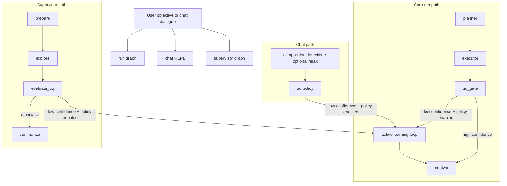

# matsim-agents

**Multi-agent AI framework for atomistic materials simulation and discovery.**

`matsim-agents` orchestrates large language models, machine-learned
interatomic potentials, and ASE-based atomistic workflows into a single
agentic loop. The user states a research objective in natural language;
agents plan, run HydraGNN-driven simulations, score chemical and
dynamical stability, and report the findings — with optional human
review at every gate.

The framework is **backend-agnostic**: HydraGNN is the default MLFF
backend, but the relaxation tool, crystal-phase generator, and stability
scorer are written so other potentials (MACE, NequIP, Orb, ...) can be
plugged in via the same interfaces.

---

## Table of contents

1. [Architecture](#architecture)
2. [Portability across DOE supercomputers](#portability-across-doe-supercomputers)
3. [Running on Frontier (OLCF)](#running-on-frontier-olcf)
4. [Running on Aurora (ALCF)](#running-on-aurora-alcf)
5. [Running on Perlmutter (NERSC)](#running-on-perlmutter-nersc)
6. [HPC Documentation Index](#hpc-documentation-index)
7. [Installation](#installation)
8. [LLM backends](#llm-backends)
9. [Downloading models for vLLM](#downloading-models-for-vllm)
10. [Quick start](#quick-start)
11. [Graph orchestration modes](#graph-orchestration-modes)
12. [Hypothesis-driven discovery chat](#hypothesis-driven-discovery-chat)
13. [Programmatic API](#programmatic-api)
14. [CLI reference](#cli-reference)
15. [Active-learning loop (HydraGNN ↔ DFT)](#active-learning-loop-hydragnn--dft)
16. [Codabench Competition](#codabench-competition)
17. [Project layout](#project-layout)
18. [Configuration reference](#configuration-reference)
19. [Current capabilities and planned work](#current-capabilities-and-planned-work)
20. [Contributing](#contributing)
21. [License & citation](#license--citation)

---

## Architecture

Reusable standalone workflow graphics:
- [docs/workflows/agentic-ai-workflow.md](docs/workflows/agentic-ai-workflow.md)
- [docs/workflows/agentic-ai-workflow-slides.md](docs/workflows/agentic-ai-workflow-slides.md)

```
                ┌──────────────────────────────────────────────┐
                │                  USER                        │
                │  natural-language objective / chat dialogue  │
                └───────────────────────┬──────────────────────┘
                                        │
                ┌───────────────────────▼──────────────────────┐
                │         LangGraph orchestration layer         │
                │                                               │
                │  (A) run: planner -> executor -> uq_gate      │
                │      -> [optional AL handoff] -> analyst      │
                │  (B) supervisor-run: prepare -> explore       │
                │      -> evaluate_uq -> [optional AL handoff]  │
                │      -> summarize                              │
                └───────────────────────┬──────────────────────┘
                                        │  tool calls
                ┌───────────────────────▼──────────────────────┐
                │              Discovery wrapper               │
                │   composition parsing → phase enumeration    │
                │   → relaxation (HydraGNN+ASE) → stability    │
                └───────────────────────┬──────────────────────┘
                                        │
                ┌───────────────────────▼──────────────────────┐
                │             Atomistic backends               │
                │   HydraGNN (fused MLFF + BranchWeightMLP)    │
                │   ASE (FIRE / BFGS / BFGSLineSearch)         │
                │   pymatgen (AFLOW prototype encyclopedia)    │
                │   pyXtal (random symmetry-aware search)      │
                └──────────────────────────────────────────────┘
```



### Capabilities

- **Multi-agent orchestration** with LangGraph: typed shared state, checkpointed steps, conditional routing, human-in-the-loop gates.
- **Hypothesis-generation chat** with any local LLM (Qwen 2.5 via Ollama by default).
- **Optional multi-LLM hypothesis debate in chat**: a proposer model drafts a
  hypothesis response, a critic model challenges weak assumptions and missing
  tests, and the proposer revises for one or more rounds (`--llm-peer-review`,
  `--critic-llm-*`, `--peer-review-rounds`).
- **Automatic composition detection** in user/LLM messages — when a new chemical formula is proposed, the system offers to run a substantial atomistic exploration.
- **Slash commands inside discovery chat**: `/relax <structure_path>` (single-structure relaxation), `/al [composition]` (trigger an active-learning handoff for the given or most recently discussed composition), and `/clear` (reset the conversation and discovery state).
- **Discovery-to-active-learning escalation policy**: when branch-weight UQ indicates low confidence, discovery can hand off to AL automatically from the same run.
- **Structured handoff audit artifacts**: JSONL records of UQ metrics, thresholds, trigger rationale, and action (`not_triggered`, `triggered_dry_run`, `triggered_run`).
- **Selectable surrogate backend for geometry relaxation**:
  - **HydraGNN** fused MLFF + branch-weight MLP stack (default).
  - **UMA** (Universal Models for Atoms) via fairchem (`--mlip-backend uma`).
  - Note: branch-weight UQ is specific to HydraGNN; UMA relaxations do not emit branch-weight metrics.
- **Unified crystal-phase seed generation** (`matsim_agents.discovery.seeds`)
  combining two complementary sources into one ranked candidate list:
  - **AFLOW prototype decoration** — every entry of the
    pymatgen-bundled AFLOW encyclopedia (~288 prototypes covering all
    230 3-D space groups and a wide range of stoichiometries: fcc, bcc,
    hcp, rocksalt, zincblende, wurtzite, fluorite, rutile, perovskite,
    spinel, Heusler, MAX phases, …) whose reduced stoichiometric ratios
    match the target is decorated with the target's elements. All
    symmetrically distinct element-to-Wyckoff assignments are
    enumerated (e.g. ABX₃ *vs* BAX₃). No hand-coded prototype tables.
  - **pyXtal random search** (`--n-random N`, novelty pass) — for
    compositions with no AFLOW match (high-entropy alloys, exotic
    stoichiometries) or simply for novelty exploration, draws `N`
    random crystals uniformly across the 230 space groups, respecting
    Wyckoff multiplicities and minimum-distance constraints. Seeds
    from this path are tagged `needs_dft_verification=True` and called
    out as `(novel)` in the stability report so they get DFT-validated
    before any publication claim. pyXtal is a core dependency (installed
    by default); the pipeline still degrades gracefully to
    prototypes-only should it ever be absent.
- **Stability scoring**: relative chemical stability (ΔE/atom rankings) and a dynamical-stability proxy (residual force tolerance).
- **Local & HPC ready, portable across diverse DOE accelerators**: same
  Python entry points run on **Frontier (OLCF, AMD MI250X)**, **Aurora
  (ALCF, Intel PVC)**, and **Perlmutter (NERSC, NVIDIA A100)**, plus
  Andes and laptops. The setup script delegates to HydraGNN's
  installers and auto-relaxes HydraGNN's overly-tight `click==8.0.0` /
  `tqdm==4.67.1` pins so the env is conflict-free on every site.
- **First-class DFT labellers built per platform**: validated
  build/run recipes for both **VASP 6.6** (Frontier MI250X, Aurora PVC)
  and **Quantum ESPRESSO `pw.x` GPU** (Frontier MI250X via OpenMP
  target offload, Aurora PVC via `oneapi`/`openmp`, Perlmutter A100 via
  CUDA). Build scripts and SLURM/PBS launchers are checked in for each
  site — see [Portability across DOE supercomputers](#portability-across-doe-supercomputers).
- **Pluggable LLMs**: Ollama, vLLM, OpenAI, Anthropic via a single factory.
- **Active-learning loop** (`matsim-agents al run`): HydraGNN-driven MD
  generates candidates → ensemble / MC-dropout uncertainty selects the
  most informative → a DFT backend (**VASP 6.6** *or* **Quantum
  ESPRESSO `pw.x`**) labels them in parallel inside one SLURM
  allocation → dataset is grown and HydraGNN is retrained → repeat. The
  DFT backend is a single YAML toggle (`dft.backend: vasp | qe`); both
  share an INCAR-style template path (`INCAR.template` / `pw.template`).
- **LLM-generated MD seeds** (`md.seed_source.kind: prompt`): the LLM
  proposes plausible chemical compositions for a target objective and
  the loop materialises seed structures from common crystal prototypes,
  no curated POSCAR collection required.
- **Templated YAML configs**: `${VAR}`, `${VAR:-default}`, `${VAR:?msg}`
  shell-style substitution with optional in-file `vars:` block, so the
  same config can be re-targeted across users / scratch dirs / runs
  without editing it.
- **Two complementary graph entry points**:
  - `matsim-agents run` for planner-executor-analyst task execution.
  - `matsim-agents supervisor-run` for discovery exploration + UQ-based decisioning + optional AL handoff.
- **Surrogate backend switch for AL/supervisor flows**: choose HydraGNN or
  UMA in the same YAML via `mlip.backend` (commonly
  `backend: ${MLIP_BACKEND:-hydragnn}`) and run with:
  - `matsim-agents al run <config.yaml>` (HydraGNN default)
  - `MLIP_BACKEND=uma matsim-agents al run <config.yaml>` (frozen UMA)
  - `MLIP_BACKEND=uma matsim-agents supervisor-run <composition> ...` (UMA in supervisor path)

## Workflow selection matrix

### Composable scientific workflow hierarchy

The public workflows form a strict dependency ladder. Higher-level workflows
reuse lower-level services and their typed results instead of duplicating
relaxation, labeling, ranking, or provenance logic:

```text
scientific run directory + provenance + validation
    -> structure relaxation (MLIP | DFT | MLIP-to-DFT)
    -> uncertainty acquisition + DFT labeling (+ optional retraining)
    -> composition/phase exploration (+ optional embedded AL)
    -> property-driven agentic investigation and hypothesis revision
```

Every workflow writes a collision-resistant directory such as
`runs/2026-09-01T14-32-18Z_a8f31c/` containing the resolved request,
provenance, event stream, structures, calculations, datasets, models, and
results. Failed and unconverged calculations are retained with an explicit
reason; they are not silently dropped or included in phase rankings.

#### Unified structure relaxation

Use `matsim-agents relax CONFIG.yaml` with `mode: mlip`, `mode: dft`, or
`mode: mlip-dft`. The last mode performs an MLIP warm start and passes its
optimized geometry to VASP or Quantum ESPRESSO. See
`examples/relaxation/scientific_relaxation.example.yaml`. DFT execution
requires explicit approval by default.

#### Active-learning safety defaults

Active learning defaults to DFT label collection without retraining:

```yaml
trainer:
  enabled: false
  promote_model: false
  promotion_approved: false
```

`enabled: true` creates a candidate model. `promote_model: true` is a separate,
explicit decision that permits the next iteration to use it and additionally
requires `promotion_approved: true` after validation metrics have been reviewed. Newly labeled
frames are checked for finite energies/forces, correct force shapes, and exact
duplicate geometries; a SHA-256 dataset manifest records the DFT energy
reference and validation summary.

#### Consistent multi-node DFT labeling

The DFT batch planner discovers Slurm allocations on Frontier/Perlmutter and
PBS nodefiles on Aurora, partitions the nodes into stable disjoint groups, and
processes one serial queue per group. This prevents a node from being reused
while its preceding VASP/QE step is still running. Facility launchers consume
the assigned host list and use every configured GPU rank per node. Set
`MATSIM_GPUS_PER_NODE` on PBS (12 for Aurora tile-as-device runs); Slurm GPU
counts are discovered from its environment. A mismatch between allocated GPUs
and `ranks_per_node` fails before launching expensive calculations.
Set `dft.max_concurrent_jobs` to impose a lower concurrency cap; when omitted,
all complete `nodes_per_job` partitions are used.

#### Thermodynamic claims

`relative_phase_ranking` compares only converged candidates generated in one
exploration. `convex_hull_ranking` additionally requires a compatible,
method-identified elemental and competing-phase reference set and reports
formation energy, energy above hull, and decomposition. Residual forces are a
convergence filter, not a thermodynamic ranking term.

Use this table to choose the right entry point quickly.

| Goal | Recommended entry point | Required inputs | Typical outputs |
|---|---|---|---|
| One-shot objective execution with planning, UQ gate, and summary | `matsim-agents run` | natural-language objective, `--logdir`, `--hydragnn-branch-mlp-checkpoint`, optional AL handoff flags | planner/executor/UQ/analyst result; optional AL handoff + JSONL audit |
| Interactive hypothesis generation with optional atomistic exploration | `matsim-agents chat` | `--logdir`, `--hydragnn-branch-mlp-checkpoint`, LLM provider/model | chat transcript + discovery artifacts under `output_dir/discovery/` |
| Optional single structure relax during chat | `matsim-agents chat` + `/relax <path>` | same as chat + structure path | one relaxation summary + optimized structure under `output_dir/single_relax/` |
| Trigger active-learning handoff during chat | `matsim-agents chat` + `/al [composition]` | same as chat + `--al-config`; composition optional (defaults to last discussed) | AL handoff (dry-run or run) + JSONL audit record |
| Reset conversation/discovery state during chat | `matsim-agents chat` + `/clear` | none | cleared session history and seen-composition state |
| Automated discovery -> UQ policy -> optional AL handoff | `matsim-agents supervisor-run` | composition, `--logdir`, `--hydragnn-branch-mlp-checkpoint`, optional `--al-config` | supervisor summary + optional AL handoff + JSONL audit records |
| Standalone active-learning loop (MD -> UQ -> DFT -> retrain/frozen) | `matsim-agents al run <config.yaml>` | AL YAML config (`mlip`, `md`, `acquisition`, `dft`, `trainer`, `loop`) + optional `MLIP_BACKEND=uma` | iteration state dirs, dataset, optional retrained model logdirs |
| Config-only validation (no execution) | `matsim-agents al validate-config <config.yaml>` | AL YAML config + env vars used in `${VAR}` placeholders | resolved/validated JSON config dump |
| Paper-case feasibility check without iterative AL | `python examples/paper_cases/singlepass.py --case <name>` | case name, `MLIP_LOGDIR`, optional `--dft` | per-case relaxed/ranked structures, optional DFT single-point validation |

Notes:

- `run`, `chat`, and `supervisor-run` can escalate to AL using `--al-config` plus UQ policy flags.
- Handoff audit artifacts default to `<output_dir>/discovery/al_handoff_events.jsonl` unless overridden.

### Minimum viable commands

Use these as starter templates; replace paths with your environment.

```bash
# 1) Core graph: planner -> executor -> uq_gate -> analyst
matsim-agents run \
  "Relax structures/mos2-B_Defect-Free_PBE.vasp and summarize results." \
  --logdir /path/to/hydragnn_logdir \
  --hydragnn-branch-mlp-checkpoint /path/to/mlp_branch_weights.pt

# 1a) Core graph with UMA relaxation backend (no HydraGNN checkpoints needed)
matsim-agents run \
  "Relax structures/mos2-B_Defect-Free_PBE.vasp and summarize results." \
  --mlip-backend uma \
  --uma-model-name uma-s-1p1 \
  --uma-task omat

# 1b) Core graph with UQ-triggered AL handoff planning
matsim-agents run \
  "Relax structures/mos2-B_Defect-Free_PBE.vasp and summarize results." \
  --logdir /path/to/hydragnn_logdir \
  --hydragnn-branch-mlp-checkpoint /path/to/mlp_branch_weights.pt \
  --trigger-al-handoff \
  --al-config examples/active_learning/al_config.example.yaml \
  --al-dry-run

# 2) Interactive discovery chat
matsim-agents chat \
  --logdir /path/to/hydragnn_logdir \
  --hydragnn-branch-mlp-checkpoint /path/to/mlp_branch_weights.pt

# 2b) Interactive chat with proposer/critic multi-LLM hypothesis debate
matsim-agents chat \
  --logdir /path/to/hydragnn_logdir \
  --hydragnn-branch-mlp-checkpoint /path/to/mlp_branch_weights.pt \
  --llm-peer-review \
  --critic-llm-provider ollama \
  --critic-llm-model qwen2.5:14b \
  --peer-review-rounds 2

# 2c) True multi-critic panel mode (multiple critics + cross-critique)
matsim-agents chat \
  --logdir /path/to/hydragnn_logdir \
  --hydragnn-branch-mlp-checkpoint /path/to/mlp_branch_weights.pt \
  --llm-peer-review \
  --critic-panel-models "qwen2.5:14b,llama3.1:8b,mistral:7b" \
  --critic-panel-providers "ollama,ollama,ollama" \
  --peer-review-rounds 2 \
  --critic-cross-critique

# 2a) Interactive discovery chat with UMA relaxations
matsim-agents chat \
  --mlip-backend uma \
  --uma-model-name uma-s-1p1 \
  --uma-task omat

# 3) Supervisor orchestration with AL handoff planning
matsim-agents supervisor-run Li2MnO3 \
  --logdir /path/to/hydragnn_logdir \
  --hydragnn-branch-mlp-checkpoint /path/to/mlp_branch_weights.pt \
  --al-config examples/active_learning/al_config.example.yaml \
  --al-dry-run

# 3a) Supervisor orchestration with UMA relaxations
matsim-agents supervisor-run Li2MnO3 \
  --mlip-backend uma \
  --uma-model-name uma-s-1p1 \
  --uma-task omat \
  --al-config examples/active_learning/al_config.example.yaml \
  --al-dry-run

# 4) Standalone active learning run
matsim-agents al validate-config examples/active_learning/al_config.example.yaml
matsim-agents al run examples/active_learning/al_config.example.yaml

# 4b) Same AL config, UMA surrogate instead of HydraGNN
MLIP_BACKEND=uma matsim-agents al run examples/active_learning/al_config.example.yaml

# 5) Paper-case single pass
python examples/paper_cases/singlepass.py --case lifepo4
```

---

## Portability across DOE supercomputers

`matsim-agents` is designed to run **the same Python code path on three
DOE leadership-class systems with three very different accelerators**.
All heavy backends (HydraGNN MLFF inference/training, vLLM model
serving, VASP, and Quantum ESPRESSO) have validated build + launcher
recipes per site, with all platform-specific gotchas (toolchains, MPI
GTL pins, ROCm/Cray cross-builds, CUDA-aware MPI) baked in.

| Capability                          | Frontier (OLCF) MI250X            | Aurora (ALCF) PVC                       | Perlmutter (NERSC) A100         |
|-------------------------------------|-----------------------------------|-----------------------------------------|---------------------------------|
| **Hardware**                        | AMD MI250X (gfx90a), 64-core EPYC | Intel Data Center GPU Max 1550 (PVC)    | NVIDIA A100 (40/80 GB), AMD EPYC|
| **HydraGNN venv**                   | ROCm 7.2.0 + PyTorch              | oneAPI + Intel Extension for PyTorch    | CUDA 12 + PyTorch               |
| **vLLM model server**               | ROCm 7.2.0, source build          | oneAPI                                  | CUDA                            |
| **VASP 6.6**                        | `build-vasp-gpu-frontier.sh`      | `build-vasp-gpu-aurora.sh` (`vasp_std`/`vasp_gam`/`vasp_ncl`) | (use site module if available)  |
| **Quantum ESPRESSO `pw.x` (GPU)**   | OpenMP target offload to gfx90a   | `QE_GPU="openmp;oneapi"`, PVC arch      | CUDA build                      |
| **Setup entry point**               | `deployments/frontier/setup/install-rocm72.sh` | `deployments/aurora/setup/install_matsim_aurora.sh` | `deployments/perlmutter/setup/install_matsim_perlmutter.sh` |
| **Active-learning launcher**        | `deployments/frontier/launchers/run-active-learning-frontier.sh` | (file-coupled via SLURM)                | (file-coupled via SLURM)        |
| **Per-platform docs**               | [docs/quantum-espresso-frontier.md](docs/quantum-espresso-frontier.md) | [docs/quantum-espresso-aurora.md](docs/quantum-espresso-aurora.md), [docs/vasp-aurora.md](docs/vasp-aurora.md) | [docs/quantum-espresso-perlmutter.md](docs/quantum-espresso-perlmutter.md) |

Single entry-point index covering all three systems:
[`docs/hpc-platforms.md`](docs/hpc-platforms.md).

Design principles that keep the code portable:

- **DFT and Python/ML stacks are never co-loaded** in the same shell
  on any platform — each uses its own module set, and the active-
  learning loop couples them through SLURM steps + the filesystem.
  This avoids the pervasive ABI/toolchain conflicts (Cray MPI GTL
  SONAMEs on Frontier, oneAPI vs PyTorch CUDA stack on Perlmutter,
  etc.) that otherwise break shared builds.
- **Backend-agnostic active learning** — the same `matsim-agents al
  run` driver works whether the labeller is VASP or QE, and on any of
  the three platforms, because the DFT backend is selected by a single
  YAML field (`dft.backend: vasp | qe`).
- **Templated YAML configs** — `${VAR}` / `${VAR:-default}` /
  `${VAR:?msg}` substitution lets one config file follow you between
  Frontier scratch, Aurora flare, and Perlmutter pscratch without
  edits.

---

## Running on Frontier (OLCF)

> **⚠️ Frontier users — read this first:**
> See [`deployments/frontier/docs/README-frontier.md`](deployments/frontier/docs/README-frontier.md)
> for required setup and known issues. **Critically: a prebuilt `tvm_ffi`
> shared library must exist at
> `$PROJ/cache/tvm-ffi/libtorch_c_dlpack_addon_torch211-rocm.so`
> (where `$PROJ` is your project's proj-shared directory) or every vLLM job
> will silently hang forever** (the script preflight check will fail-fast in
> 2 seconds with a clear error message). If missing, rebuild with
> `sbatch deployments/frontier/setup/prebuild-tvm-ffi-frontier.sh`.

### Quantum ESPRESSO (DFT) backend on Frontier

The repo also ships a fully reproducible recipe for building Quantum
ESPRESSO `develop` with **AMD MI250X (gfx90a) OpenMP target offload**:

- Build script: [`deployments/frontier/setup/build-qe-gpu-frontier.sh`](deployments/frontier/setup/build-qe-gpu-frontier.sh)
- Run launcher: [`deployments/frontier/launchers/run-pw-gpu-frontier.sh`](deployments/frontier/launchers/run-pw-gpu-frontier.sh)
- Full docs: [`docs/quantum-espresso-frontier.md`](docs/quantum-espresso-frontier.md)
- Platform index: [`docs/hpc-platforms.md`](docs/hpc-platforms.md)

The build is cross-compiled on a login node and produces ~92 binaries
(`pw.x`, `cp.x`, `ph.x`, `pp.x`, `neb.x`, `epw.x`, `kcw.x`, `tddfpt`/
`turbo_*` suite, `pioud.x`, `all_currents.x`, …) under
`external/quantum-espresso/install-gpu/bin/` (gitignored). The recipe
includes baked-in workarounds for the cce/18.0.1 ftn-7991 ICE, the
PIOUD `etime()` link error (rewritten to F95 `cpu_time`), and the
rocm/7.x cray-mpich SONAME mismatch.

QE uses a different module stack than matsim-agents' Python; the two
are deliberately kept isolated and coupled only through Slurm + files.

### VASP (DFT) backend on Frontier

VASP 6.6 is also wired up on Frontier MI250X for the active-learning
labeller path:

- Build script: [`deployments/frontier/setup/build-vasp-gpu-frontier.sh`](deployments/frontier/setup/build-vasp-gpu-frontier.sh)
- In-allocation step launcher (called by the AL loop):
  [`deployments/frontier/launchers/_vasp-step-frontier.sh`](deployments/frontier/launchers/_vasp-step-frontier.sh)

As with QE, the proprietary VASP source itself is **not** committed;
only the build recipe is. The repository assumes you have a licensed
VASP source tree under `external/vasp6/`.

---

## Running on Aurora (ALCF)

The repository also includes a validated build/run path for Quantum
ESPRESSO with Intel GPU offload on Aurora.

- Build script: [`deployments/aurora/setup/build-qe-gpu-aurora.sh`](deployments/aurora/setup/build-qe-gpu-aurora.sh)
- Run launcher: [`deployments/aurora/launchers/run-pw-gpu-aurora.sh`](deployments/aurora/launchers/run-pw-gpu-aurora.sh)
- Full docs: [`docs/quantum-espresso-aurora.md`](docs/quantum-espresso-aurora.md)
- Platform index: [`docs/hpc-platforms.md`](docs/hpc-platforms.md)

Validated outcome in this repo:

- successful CMake build + install (exit code 0)
- 106 installed executables in `external/quantum-espresso/install-gpu/bin/`
- core binaries verified: `pw.x`, `cp.x`, `ph.x`, `pp.x`, `epw.x`

Quick run pattern:

```bash
bash deployments/aurora/launchers/run-pw-gpu-aurora.sh path/to/pw.in
```

Aurora QE and the Python/ML environment are intentionally isolated and
typically coupled only via files and scheduler jobs.

For VASP on Aurora, the repository keeps only build provenance, not the vendor
source itself. The recorded makefile lineage is documented in
[`docs/vasp-aurora.md`](docs/vasp-aurora.md), including the upstream template
used (`arch/makefile.include.oneapi_omp_off`) and the local working makefile
path under `external/vasp6/`. The Aurora build entry point is
[`deployments/aurora/setup/build-vasp-gpu-aurora.sh`](deployments/aurora/setup/build-vasp-gpu-aurora.sh),
which defaults to building `vasp_std`, `vasp_gam`, and `vasp_ncl` in one run.

### vLLM on Aurora (Intel PVC)

Aurora supports vLLM-XPU serving and inference via the official ALCF `frameworks` module stack (Python 3.12, torch-xpu, ipex, vllm, ray, triton). The repo provides:

- **Single-node smoke test:** [`deployments/aurora/smoke-tests/smoke-vllm-singlenode-aurora.sh`](deployments/aurora/smoke-tests/smoke-vllm-singlenode-aurora.sh)
- **Advanced launchers:** [`deployments/aurora/jobs/job-serve-multinode-vllm-aurora.sh`](deployments/aurora/jobs/job-serve-multinode-vllm-aurora.sh) (multi-node Ray serve), plus single-relax, active-learning, and QE warmstart launchers

**Key requirements and gotchas:**

- **PVC visibility:** On Aurora compute nodes, bare `python` does NOT see the GPUs. Always wrap Python in `mpiexec -n 1 --ppn 1` (as in the smoke script) to expose XPUs via PALS.
- **Device mask:** Use `ZE_FLAT_DEVICE_HIERARCHY=FLAT` and a non-dotted `ZE_AFFINITY_MASK` (e.g., `0,1` for TP=2). In FLAT, each tile is a root device; dotted notation (`0.0,0.1`) is only valid in COMPOSITE and will result in `device_count()=0` in FLAT.
- **TMPDIR:** PBS sets `$TMPDIR` to a long path that exceeds the Unix socket limit for ZMQ IPC. Always set `export TMPDIR=/tmp` before launching vLLM.
- **oneCCL KVS:** Do NOT set `CCL_KVS_MODE=mpi` or `CCL_PROCESS_LAUNCHER=pmix` for vLLM. vLLM's multiproc_executor uses forked workers, not MPI ranks; oneCCL must use its default internal KVS over TCP.
- **Debug queue:** The default `debug` queue has a per-user limit of 1 queued job and short walltime. For parallel jobs, use `workq` or `prod`.
- **Model download:** Place models in `$PROJ/models/` (e.g., Mistral-Small-24B-Instruct-2501). Use the provided `hf_download.py` script if needed.

**To run the smoke test:**

1. Build the vLLM XPU venv (if not already):
  ```bash
  bash deployments/aurora/setup/install-vllm-xpu-aurora.sh
  ```
2. Download a supported model (e.g., Mistral-Small-24B):
  ```bash
  source /path/to/hydragnn_venv/bin/activate
  python deployments/aurora/setup/hf_download.py mistralai/Mistral-Small-24B-Instruct-2501
  ```
3. Submit the smoke test:
  ```bash
  qsub deployments/aurora/smoke-tests/smoke-vllm-singlenode-aurora.sh
  # or override model:
  qsub -v SMOKE_MODEL_PATH=$PROJ/models/Qwen2.5-32B-Instruct deployments/aurora/smoke-tests/smoke-vllm-singlenode-aurora.sh
  ```
4. Inspect results in `runs/smoke-vllm-singlenode-<jobid>/`.

If the job fails, check `vllm.log` for device mask, TMPDIR, or oneCCL errors. Each error layer is documented in the script comments.

For multi-node serving, see the advanced launchers in `deployments/aurora/jobs/`.

## Running on Perlmutter (NERSC)

Perlmutter (NERSC, NVIDIA A100) is supported as a first-class target
for both the Python/ML stack and Quantum ESPRESSO GPU.

- Setup overview: [`deployments/perlmutter/setup/README.md`](deployments/perlmutter/setup/README.md)
- Matsim env install: [`deployments/perlmutter/setup/install_matsim_perlmutter.sh`](deployments/perlmutter/setup/install_matsim_perlmutter.sh)
- QE GPU build: [`deployments/perlmutter/setup/build-qe-gpu-perlmutter.sh`](deployments/perlmutter/setup/build-qe-gpu-perlmutter.sh)
  (CPU-only variant: [`build-qe-cpu-perlmutter.sh`](deployments/perlmutter/setup/build-qe-cpu-perlmutter.sh))
- QE detailed build guide: [`deployments/perlmutter/setup/QE-BUILD-GUIDE.md`](deployments/perlmutter/setup/QE-BUILD-GUIDE.md)
- Full QE docs: [`docs/quantum-espresso-perlmutter.md`](docs/quantum-espresso-perlmutter.md)
- Launchers:
  - QE `pw.x` GPU: [`deployments/perlmutter/launchers/run-pw-gpu-perlmutter.sh`](deployments/perlmutter/launchers/run-pw-gpu-perlmutter.sh)
  - QE warm-start benchmark: [`deployments/perlmutter/launchers/run-qe-warmstart-benchmark-perlmutter.sh`](deployments/perlmutter/launchers/run-qe-warmstart-benchmark-perlmutter.sh)
  - Single-node / multi-node / all-models LLM smoke tests:
    `launch-test-singlenode-resume-perlmutter.sh`,
    `launch-test-multinode-perlmutter.sh`,
    `launch-test-all-models-perlmutter.sh`

Quick run pattern:

```bash
./deployments/perlmutter/launchers/run-pw-gpu-perlmutter.sh path/to/pw.in
```

As on Frontier and Aurora, the DFT module stack and the Python/ML
environment are intentionally isolated and coupled only through Slurm
+ files.

---

## HPC Documentation Index

For a single entry point across Frontier, Aurora, Perlmutter, and model-serving
docs, see [`docs/hpc-platforms.md`](docs/hpc-platforms.md).

---

## Installation

`matsim-agents` depends on HydraGNN (which itself wraps PyTorch + PyTorch
Geometric). The provided installer delegates the heavy install to
HydraGNN's official scripts so the same code path works on a laptop and
on a DOE supercomputer.

```bash
git clone git@code.ornl.gov:multi-agentic-ai-materials/matsim-agents.git
cd matsim-agents

# Local workstation (CPU or single GPU)
./scripts/setup_env.sh

# Frontier (OLCF, ROCm 7.2 — current standard)
bash deployments/frontier/setup/install-rocm72.sh

# Perlmutter (NERSC)
PLATFORM=perlmutter ./scripts/setup_env.sh
```

Available `PLATFORM` values for the generic `setup_env.sh`:
`workstation` (default), `perlmutter`, `aurora`, `andes`,
`frontier-rocm71`, `frontier-rocm64` (legacy — the supported Frontier
path is `deployments/frontier/setup/install-rocm72.sh`).

### ROCm version matrix on Frontier

The three Frontier-targeted backends in this repo do **not** all use the
same ROCm version. The combinations below are what is actually wired up
in the scripts and what you should expect at runtime:

| Backend | Module | Why this version |
|---|---|---|
| **HydraGNN venv** (used by every Frontier launcher: vLLM, HF, downloaders, smoke tests, six-model bench) | `rocm/7.2.0` | Current Frontier-supported PyTorch + ROCm path; built once into `HydraGNN-Installation-Frontier-ROCm72/hydragnn_venv_rocm72/` |
| **vLLM model server** | `rocm/7.2.0` | Shares the HydraGNN ROCm 7.2 venv; built from source via [`deployments/frontier/setup/build-vllm-rocm72.sh`](deployments/frontier/setup/build-vllm-rocm72.sh) |
| **Quantum ESPRESSO GPU** | `rocm/6.2.4` *(forced)* | Frontier's `cray-mpich/8.1.31` GTL `libmpi_gtl_hsa.so` is hard-linked against `libamdhip64.so.6` (rocm 6.x SONAME). rocm/7.x ships `.so.7` and breaks the MPI Fortran link probe at CMake configure. Pin documented in [`docs/quantum-espresso-frontier.md`](docs/quantum-espresso-frontier.md). |

QE and the Python/ML stacks are deliberately never co-loaded in the same
shell; they couple through Slurm + the filesystem.

Environment overrides accepted by the installer:

| Variable | Purpose | Default |
|---|---|---|
| `PYTHON` | Python interpreter | `python3` |
| `HYDRAGNN_REPO` | HydraGNN git URL | `https://github.com/ORNL/HydraGNN.git` |
| `HYDRAGNN_REF` | Branch/tag/commit | `main` |
| `HYDRAGNN_DIR` | Reuse an existing HydraGNN checkout | `third_party/HydraGNN` |
| `HYDRAGNN_EXTRAS` | Args forwarded to `install_dependencies.sh` | `all dev` |
| `LLM_BACKENDS` | Subset of `ollama vllm openai anthropic huggingface` | `ollama vllm` |
| `BOOTSTRAP_OLLAMA` | Set to `1` to install the Ollama daemon, start it, and pull `OLLAMA_MODELS` (workstation only) | `0` |
| `OLLAMA_MODELS` | Space-separated list of models to pull when `BOOTSTRAP_OLLAMA=1` | `qwen2.5:14b` |

After the script finishes:

```bash
source .venv/bin/activate    # workstation case
matsim-agents --help
```

To bootstrap the local Ollama daemon and pull a model in one go:

```bash
BOOTSTRAP_OLLAMA=1 OLLAMA_MODELS="qwen2.5:14b llama3.1:8b" \
    ./scripts/setup_env.sh
```

---

## LLM backends

Set the provider at runtime via CLI flag, environment variable, or in
code. Local/open-source backends are the default.

For a detailed comparison of the two open-source local backends (vLLM vs
HuggingFace Transformers + Accelerate) — including pros, cons, and guidance
for Frontier (ROCm) — see [docs/llm-backends-comparison.md](docs/llm-backends-comparison.md).

| Provider | Install | Typical model | Notes |
|---|---|---|---|
| **`ollama`** *(default)* | `brew install ollama && ollama pull qwen2.5:14b` | `qwen2.5:14b`, `llama3.1:8b`, `deepseek-r1:14b` | Fully local, CPU/GPU/Metal. |
| **`vllm`** | Run a vLLM server (`vllm serve <model> --port 8000`) | `meta-llama/Llama-3.1-8B-Instruct` | OpenAI-compatible; great for HPC. |
| **`openai`** | `pip install matsim-agents[openai]` | `gpt-4o-mini` | Hosted. Set `OPENAI_API_KEY`. |
| **`anthropic`** | `pip install matsim-agents[anthropic]` | `claude-3-5-sonnet-latest` | Hosted. Set `ANTHROPIC_API_KEY`. |
| **`huggingface`** | `pip install matsim-agents[huggingface]` | `Qwen/Qwen2.5-72B-Instruct` | Direct HF Transformers + Accelerate; no server needed. Ideal as fallback on HPC when vLLM is unavailable. Set `MATSIM_HF_MODEL_PATH` to a local model directory. |

### Downloading models for vLLM

For the vLLM backend you need to download the model weights locally before
starting the server. The recommended model for matsim-agents on HPC is
`Qwen/Qwen2.5-72B-Instruct`. A quick one-liner using the `hf` CLI that ships
with `huggingface_hub>=1.12`:

```bash
hf download Qwen/Qwen2.5-72B-Instruct \
    --local-dir /path/to/models/Qwen2.5-72B-Instruct
```

For detailed instructions — including Frontier-specific steps, running the
download as a background job, and resuming interrupted downloads — see
[docs/model-download.md](docs/model-download.md).

Configuration knobs:

```bash
export MATSIM_LLM_PROVIDER=ollama          # or vllm | openai | anthropic | huggingface
export MATSIM_OLLAMA_BASE_URL=http://...    # optional
export MATSIM_VLLM_BASE_URL=http://node:8000/v1
export MATSIM_VLLM_API_KEY=EMPTY            # only if vLLM is auth-protected
export MATSIM_HF_MODEL_PATH=/path/to/model  # huggingface provider: local model dir
```

### First-class open-model support

The generic `vllm` and `huggingface` providers can address arbitrary model
identifiers, but a checkpoint is called **first-class supported** only when it
is present in
[`deployments/common/open-model-catalog.json`](deployments/common/open-model-catalog.json).
Every catalog entry has all of the following:

- a canonical Hugging Face checkpoint identifier;
- a named endpoint environment variable plus the shared
  `MATSIM_VLLM_BASE_URL` fallback;
- entries in both Frontier benchmark manifests;
- download support on Frontier, Aurora, and Perlmutter; and
- inclusion in the sequential model benchmark.

CI enforces this contract in `tests/test_open_model_catalog.py`. Adding a model
to the catalog without adding any required deployment path fails the test, so
the backend-compatible and first-class sets cannot silently drift apart.

The frontier open-model catalog currently covers Kimi K2.5, GLM-4.7 and
GLM-4.7-Flash, DeepSeek-V3.2, Mistral Large 3, Qwen3-235B-A22B Instruct and
Thinking, Gemma 4, and Devstral 2. These checkpoints vary enormously in size.
Catalog membership means the repository knows how to select, download, and
benchmark the model; it does not mean that every model fits on one node. Use
the multi-node serving launcher and choose tensor parallelism appropriate to
the checkpoint and facility.

Model-specific vLLM behavior continues to be controlled by the serving
environment. In particular, use a vLLM release that supports the checkpoint's
architecture and chat template, and pass any required reasoning/tool parser
arguments through the serving command. A successfully downloaded checkpoint
is not treated as a successful deployment until the smoke request completes.

---

## Quick start

### 1. Run the agent graph end-to-end

```bash
matsim-agents run \
  "Relax structures/mos2-B_Defect-Free_PBE.vasp and report the final energy." \
  --logdir ./multidataset_hpo-BEST6-fp64 \
  --hydragnn-branch-mlp-checkpoint ./mlp_branch_weights.pt \
  --llm-provider ollama --llm-model qwen2.5:14b
```

### 2. Hypothesis-generation chat with auto-triggered exploration

```bash
ollama pull qwen2.5:14b

matsim-agents chat \
  --logdir ./multidataset_hpo-BEST6-fp64 \
  --hydragnn-branch-mlp-checkpoint ./mlp_branch_weights.pt \
  --n-random 50 --random-seed 0
```

A typical session:

```
you> I want a Pb-free halide double perovskite for photovoltaics with band gap near 1.5 eV.

assistant> A promising candidate is Cs2AgBiBr6 ...

Proposed composition detected: AgBiBr6Cs2. Run HydraGNN-based phase exploration? [y/N]: y

>>> Exploring composition AgBiBr6Cs2
  starting double_perovskite   .../AgBiBr6Cs2_double_perovskite.vasp
  done    double_perovskite   E=-365.4123 eV  |F|max=0.0118 eV/Å  steps=112

Stability report for AgBiBr6Cs2:
  Predicted ground state: AgBiBr6Cs2_double_perovskite_optimized_structure.vasp
  E/atom = -9.1353 eV   |F|max = 0.012 eV/Å   dynamically_stable_proxy = True
  Chemical-stability proxy: PASS

you> Now suggest a Sb-substituted variant.
```

### 3. Supervisor orchestration (discovery -> UQ -> optional AL handoff)

```bash
matsim-agents supervisor-run Li2MnO3 \
  --logdir ./multidataset_hpo-BEST6-fp64 \
  --hydragnn-branch-mlp-checkpoint ./mlp_branch_weights.pt \
  --al-config examples/active_learning/al_config.example.yaml \
  --al-dry-run
```

To execute AL instead of dry-run, replace `--al-dry-run` with `--al-run`.

### 3. Novelty-only exploration of exotic compositions

For compositions that have no AFLOW prototype match (e.g. 5-element
high-entropy alloys), disable the prototype branch entirely and let
pyXtal characterize the configuration space:

```bash
matsim-agents chat \
  --logdir ./multidataset_hpo-BEST6-fp64 \
  --hydragnn-branch-mlp-checkpoint ./mlp_branch_weights.pt \
  --n-random 200 --random-seed 42
```

When the conversation introduces an unusual stoichiometry, the discovery
wrapper will report `No AFLOW prototype match` and rely on the pyXtal
pass; the resulting candidates are flagged `(novel)` in the stability
table.

---

## Graph orchestration modes

The repository currently exposes two LangGraph workflows that share the
same numerical kernels (discovery wrapper, relaxations, AL loop):

- **Core agent graph** (`matsim-agents run`): planner -> executor -> uq_gate -> analyst,
  with optional run-path AL handoff when UQ policy is triggered.
- **Supervisor graph** (`matsim-agents supervisor-run`):
  prepare composition -> explore composition -> evaluate UQ -> optional
  active-learning handoff -> summarize.

This split keeps decision logic agentic while preserving deterministic,
restart-friendly HPC kernels for heavy computation.

### Core agent graph

Four nodes share a typed `MatSimState`:

- **planner** — turns the objective into a list of `TaskSpec` items
  (kinds: `relax`, `analyze`, `report`). Uses the LLM with structured
  output; falls back to a deterministic plan when the LLM is unavailable.
- **executor** — pops the next task, dispatches the matching tool
  (currently `relax_structure`), appends a `RelaxationResult` to the
  state, increments `iteration`. Routed back to itself until the queue
  drains or `max_iterations` is reached.
- **uq_gate** — aggregates branch-weight confidence over relaxation
  results and applies policy thresholds. If low-confidence criteria are
  met and handoff is enabled, this node can launch active learning
  (`--al-config`, `--al-dry-run/--al-run`) and append structured handoff
  events to the state.
- **analyst** — summarizes the accumulated results into a human-readable
  report (LLM-assisted when available, deterministic baseline otherwise),
  including handoff decisions/events when present.

State is checkpointed via LangGraph's `MemorySaver`, so every node
transition is replayable and inspectable.

---

## Hypothesis-driven discovery chat

The `chat` REPL is more than a wrapper around the LLM — it is a
**closed loop between dialogue and atomistic simulation**:

1. The user and the assistant exchange messages about a target property.
2. After each turn, [`extract_compositions`](src/matsim_agents/discovery/composition.py) scans both messages for chemical formulas (validates element symbols, reduces stoichiometry, ignores English words like "Carbon" or "Hello").
3. For every newly-seen formula the user is asked (or `--auto-confirm` is honored) whether to launch a substantial atomistic exploration.
4. The wrapper [`explore_composition`](src/matsim_agents/discovery/wrapper.py) then:
   - **generates seeds** through the unified
     [`matsim_agents.discovery.seeds.generate_seeds`](src/matsim_agents/discovery/seeds.py)
     entry point, which combines:
     1. **AFLOW prototype decoration.** Every prototype in the
        pymatgen-bundled AFLOW encyclopedia whose reduced stoichiometric
        ratios match the target composition is substituted with the
        target's elements. All symmetrically distinct
        element-to-placeholder assignments are enumerated (e.g. ABX₃
        vs BAX₃). This recovers fcc/bcc/hcp/rocksalt/zincblende/
        wurtzite/fluorite/rutile/perovskite/spinel/Heusler/MAX/… from a
        single uniform source — no per-stoichiometry rules.
     2. **pyXtal random search** (`--n-random N`). `N` random crystals
        are drawn uniformly across the 230 space groups, respecting
        Wyckoff multiplicities and minimum interatomic distances. Each
        such seed is tagged `needs_dft_verification=True` and surfaced
        with a `(novel)` marker in the live table so it is treated as
        a candidate for follow-up DFT validation rather than a
        publishable claim. When the target composition has no AFLOW
        match (e.g. a 5-element high-entropy alloy), this is the only
        active source and `--n-random` should be raised accordingly.
   - **relaxes** each seed with HydraGNN + ASE (FIRE/BFGS).
   - **scores** chemical stability (ΔE/atom ranking, near-degeneracy
     warning) and a dynamical-stability proxy (max residual force),
     keeping the `source` (`prototype` vs `random`) and AFLOW
     `prototype_id` / `space_group` of every candidate in the report.
5. The summary is fed back into the conversation as a discovery user-turn
  payload so the LLM can refine its hypothesis on the next turn.

Discovery chat can also run optional control actions through slash commands:

- **Single-structure relaxation command**:
  - `/relax path/to/structure.vasp`
- **Active-learning handoff command**:
  - `/al` (use the most recently discussed composition)
  - `/al Li2MnO3` (specify the composition explicitly)
  - Requires `--al-config`; respects the `--al-dry-run/--al-run` setting.
- **Reset command**:
  - `/clear` (clear the conversation history and discovery state for the session)
- **UQ-based AL handoff** (automatic policy knobs on CLI):
  - `--trigger-al-handoff/--no-trigger-al-handoff`
  - `--al-config <base_al_yaml>`
  - `--al-dry-run/--al-run`
  - `--uq-top-weight-threshold`
  - `--uq-min-unreliable-fraction`
  - `--uq-min-relaxations-for-handoff`
  - `--al-handoff-audit-path`

If `--al-handoff-audit-path` is not set, handoff events default to:

```
<output_dir>/discovery/al_handoff_events.jsonl
```

Output artifacts per composition (under `--output-dir`):

```
outputs/discovery/<formula>/
  seeds/    <formula>_<prototype_id>[_v<k>].vasp          # AFLOW decoration variant k
            <formula>_random_<sg>_<i>.vasp               # pyXtal seed in space group <sg>
  relaxed/  <formula>_<seed>_optimized_structure.vasp
            <formula>_<seed>_optimization.traj           # ASE trajectory
            <formula>_<seed>_optimization.csv            # per-step E, |F|max, branch weights
```

Seeds carry their provenance (`source`, `prototype_id`, `space_group`,
`needs_dft_verification`) on the `PhaseCandidate` Pydantic model so
downstream scorers can filter or weight them.

> **Honest caveats.** The AFLOW prototype set covers known crystal
> topologies for stoichiometries that match an existing entry — exotic
> ratios fall back to the pyXtal random pass, which is novelty-oriented
> and intentionally flagged for DFT verification. The dynamical-
> stability check is a force-residual proxy, not a full phonon
> analysis; plug in phonopy for the rigorous version. For broader
> generative coverage (CALYPSO, USPEX, AIRSS, diffusion models, …) add
> a new branch to `generate_seeds` — every consumer already routes
> through that single entry point.
>
> **Composition detection is regex-based.** The chat REPL extracts
> target materials by pattern-matching chemical formulas (`Li2MnO3`,
> `CrMoNbTaW`) in user and assistant text via
> [`extract_compositions`](src/matsim_agents/discovery/composition.py).
> This is intentionally minimal but has known failure modes:
> - **Fires on context, not intent.** `"CO2 emissions are dominated by
>   CaO formation"`, `"Following Smith et al. on BaTiO3 ferroelectrics
>   we instead study SrTiO3"`, or `"avoid the toxic As2O3 phase"` will
>   all trigger a prompt for the wrong (or every) formula. Space-group
>   strings like `"P3"`, `"C2/c"`, and DFT-functional names like
>   `"B3LYP"` parse as `P+3`, `C+2`, `B+3` and pass the validator.
> - **Misses verbal proposals.** `"lithium manganate at the 2-1-3
>   stoichiometry"`, `"the Li-Mn-O ternary"`, Unicode subscripts
>   (`Li₂MnO₃`), parentheses-with-alternation (`(Li,Na)2MnO3`), and
>   fractional stoichiometries (`Li2Mn0.5Ni0.5O2`) are not detected.
> - **Cannot read polarity.** `"DO NOT explore Li2MnO3"` triggers the
>   same prompt as `"please explore Li2MnO3"`. The interactive y/N
>   confirmation (or `--auto-confirm` for batch runs) is what stands
>   between these and a wasted multi-hour relaxation.
>
> The natural replacement is a tool-calling LLM that explicitly invokes
> `explore_composition(formula, rationale)` when it actually means to
> compute the material, which would eliminate every class above; a
> migration of the chat REPL onto a LangGraph `ToolNode` is the right
> moment to do this.

---

## Programmatic API

### Single relaxation

```python
from matsim_agents.backends.mlip.relaxation import RelaxStructureInput, _run

result = _run(RelaxStructureInput(
    structure_path="structures/mos2.vasp",
    logdir="./multidataset_hpo-BEST6-fp64",
  hydragnn_branch_mlp_checkpoint="./mlp_branch_weights.pt",
    optimizer="FIRE",
    maxiter=200,
))
print(result.final_energy_eV, result.optimized_structure_path)
```

### Composition exploration

```python
from matsim_agents.discovery import explore_composition

# Default: every applicable AFLOW prototype + 50 pyXtal random seeds.
result = explore_composition(
    "Cs2AgBiBr6",
    logdir="./multidataset_hpo-BEST6-fp64",
  hydragnn_branch_mlp_checkpoint="./mlp_branch_weights.pt",
    output_dir="./outputs",
)
print(result.stability.summary)

# Prototype-only run (pyXtal pass disabled).
result = explore_composition(
    "MoS2",
    logdir="./multidataset_hpo-BEST6-fp64",
  hydragnn_branch_mlp_checkpoint="./mlp_branch_weights.pt",
    output_dir="./outputs",
    n_random=0,
)

# Novelty-heavy run for an exotic / high-entropy composition with no
# AFLOW match — rely entirely on pyXtal.
result = explore_composition(
    "FeCoNiCrMn",
    logdir="./multidataset_hpo-BEST6-fp64",
  hydragnn_branch_mlp_checkpoint="./mlp_branch_weights.pt",
    output_dir="./outputs",
    n_random=200,
    random_seed=42,
)
```

### Run the core LangGraph workflow

```python
import uuid
from matsim_agents.orchestration.objective_graph import build_graph
from matsim_agents.orchestration.state import MatSimState

graph = build_graph()
final = graph.invoke(
    MatSimState(
        objective="Relax structures/foo.vasp and summarize.",
        llm_provider="ollama",
        llm_model="qwen2.5:14b",
    ),
    config={"configurable": {
        "thread_id": str(uuid.uuid4()),
        "logdir": "./multidataset_hpo-BEST6-fp64",
      "hydragnn_branch_mlp_checkpoint": "./mlp_branch_weights.pt",
    }},
)
print(final["analysis"])
```

### Run the supervisor LangGraph workflow

```python
from matsim_agents.supervisor import SupervisorConfig, run_supervisor

final = run_supervisor(SupervisorConfig(
  composition="Li2MnO3",
  logdir="./multidataset_hpo-BEST6-fp64",
  hydragnn_branch_mlp_checkpoint="./mlp_branch_weights.pt",
  output_dir="./outputs",
  trigger_active_learning_on_high_uq=True,
  active_learning_config="examples/active_learning/al_config.example.yaml",
  active_learning_dry_run=True,
))
print(final.get("summary"))
```

### Embed the chat loop in your own app

```python
from matsim_agents.chat import DiscoveryChatConfig, DiscoveryChatSession, chat_once

session = DiscoveryChatSession(config=DiscoveryChatConfig(
    logdir="./multidataset_hpo-BEST6-fp64",
  hydragnn_branch_mlp_checkpoint="./mlp_branch_weights.pt",
    output_dir="./outputs",
    llm_model="qwen2.5:14b",
    auto_confirm=True,
))
reply = chat_once(session, "Propose a Pb-free perovskite for PV.")
```

---

## CLI reference

```text
matsim-agents run     OBJECTIVE [options]   # planner -> executor -> uq_gate -> analyst
matsim-agents plan    OBJECTIVE             # show the planner's task list
matsim-agents chat    [options]             # interactive discovery REPL
matsim-agents supervisor-run COMPOSITION [options]  # discovery -> UQ -> optional AL handoff
matsim-agents al      run CONFIG.yaml       # active-learning loop (HydraGNN <-> DFT)
matsim-agents al      validate-config CONFIG.yaml   # parse + dump resolved config as JSON
```

Common options (all commands that touch HydraGNN):

| Flag | Description |
|---|---|
| `--logdir PATH` | HydraGNN logdir with `config.json` and checkpoint. |
| `--hydragnn-branch-mlp-checkpoint PATH` | BranchWeightMLP `.pt` file. |
| `--checkpoint NAME` | HydraGNN checkpoint filename or absolute path. |
| `--mlp-device {cuda,cpu}` | Device for the auxiliary MLP. |
| `--precision {fp32,fp64,bf16}` | HydraGNN precision override. |
| `--mlp-precision {fp32,fp64,bf16}` | MLP precision override. |
| `--llm-provider {ollama,vllm,openai,anthropic,huggingface}` | Chat backend. |
| `--llm-model NAME` | Provider-specific model identifier. |
| `--llm-base-url URL` | Override server URL (Ollama / vLLM). |

`chat`-specific:

| Flag | Description |
|---|---|
| `--output-dir PATH` | Where discovery artifacts are written (default `./outputs`). |
| `--ase-structure-optimizer {FIRE,BFGS,BFGSLineSearch}` | ASE optimizer for relaxations. |
| `--maxiter INT` | Max relaxation steps per seed (default `200`). |
| `--fmax FLOAT` | Stop relaxation when max residual force is below this (eV/Å, default `0.02`). |
| `--n-random INT` | Number of supplementary pyXtal random structures per composition, in addition to every applicable AFLOW prototype decoration (default `50`). Set to `0` to disable the pyXtal pass; silently degrades to `0` if pyXtal is not installed. |
| `--random-seed INT` | RNG seed for the pyXtal sampler (reproducibility). |
| `--auto-confirm / --ask` | Skip the y/N prompt for every detected composition. |
| `--trigger-al-handoff / --no-trigger-al-handoff` | Enable or disable UQ-driven escalation to active learning. |
| `--al-config PATH` | Base AL YAML used when handoff is triggered. |
| `--al-dry-run / --al-run` | Plan/report AL handoff only, or execute AL loop. |
| `--uq-top-weight-threshold FLOAT` | Trigger handoff when mean top branch weight is below this value. |
| `--uq-min-unreliable-fraction FLOAT` | Trigger handoff when the low-confidence fraction exceeds this value. |
| `--uq-min-relaxations-for-handoff INT` | Minimum number of relaxations before evaluating handoff policy. |
| `--al-handoff-audit-path PATH` | Optional JSONL path for UQ and handoff audit artifacts. |

`run`-specific:

| Flag | Description |
|---|---|
| `OBJECTIVE` | Natural-language task objective for planner/executor. |
| `--max-iterations INT` | Maximum executor iterations before forcing analysis. |
| `--trigger-al-handoff / --no-trigger-al-handoff` | Enable or disable UQ-driven AL escalation after run relaxations. |
| `--al-config PATH` | Base AL YAML used when run-path handoff is triggered. |
| `--al-dry-run / --al-run` | Plan/report run->AL handoff only, or execute AL loop. |
| `--uq-top-weight-threshold FLOAT` | Trigger handoff when mean top branch weight is below this value. |
| `--uq-min-unreliable-fraction FLOAT` | Trigger handoff when low-confidence fraction exceeds this value. |
| `--uq-min-relaxations-for-handoff INT` | Minimum relaxations before evaluating run-path handoff policy. |
| `--al-handoff-audit-path PATH` | Optional JSONL path for UQ and run->AL handoff audit artifacts. |

`supervisor-run`-specific:

| Flag | Description |
|---|---|
| `COMPOSITION` | Target composition for one supervisor pass (e.g. `Li2MnO3`). |
| `--trigger-al-handoff / --no-trigger-al-handoff` | Enable or disable UQ-driven AL handoff policy. |
| `--al-config PATH` | Base AL YAML used for optional handoff execution. |
| `--al-dry-run / --al-run` | Dry-run handoff planning or real AL execution. |
| `--uq-top-weight-threshold FLOAT` | UQ threshold on mean top branch weight. |
| `--uq-min-unreliable-fraction FLOAT` | UQ threshold on low-confidence fraction. |
| `--uq-min-relaxations-for-handoff INT` | Min relaxations required before handoff is considered. |
| `--al-handoff-audit-path PATH` | Optional JSONL path for decision artifacts. |

---

## Active-learning loop (HydraGNN ↔ DFT)

The `matsim-agents al` subcommand runs an end-to-end active-learning loop
that grows a HydraGNN training set from DFT labels of structures the
current model is most uncertain about. Both **VASP 6.6** and **Quantum
ESPRESSO `pw.x`** are supported as the labeller — the choice is a single
YAML field.

```
  HydraGNN MLFF ── MD ──► candidates ────────────────────────────────────┐
        ▲                       │                                            │
        │                       ▼                                            │
        │             ensemble / MC-dropout                                   │
        │             uncertainty + diversity                                 │
        │                       │                                            │
        │                       ▼                                            │
        │             top-K most informative                                  │
        │                       │                                            │
        │                       ▼                                            │
        │             DFT backend (parallel, in-allocation)                   │
        │             vasp_std  │  pw.x  (one toggle)                         │
        │                       │                                            │
        │                       ▼                                            │
        │             dataset.extxyz / dataset.db  (tagged with backend)      │
        │                       │                                            │
        │                       ▼                                            │
        └─ retrain HydraGNN ── next iteration ─────────────────────────────┘
```

### Quick start

```bash
# 1. Edit the templated example, or override via env vars at runtime
export PROJ_ROOT=$PWD
export RUNS_ROOT=/lustre/orion/<proj>/scratch/$USER/runs
export RUN_TAG=al-mptrj-001
export DFT_BACKEND=qe          # or: vasp

# 2. Validate the resolved config (no run)
matsim-agents al validate-config examples/active_learning/al_config.example.yaml

# 3. Submit on Frontier
sbatch --export=ALL,AL_CONFIG=$PWD/examples/active_learning/al_config.example.yaml \
    -N 64 -t 12:00:00 \
    deployments/frontier/launchers/run-active-learning-frontier.sh
```

### Backend toggle

The example YAML carries both backend sub-blocks; flip `dft.backend:` to
select one. The unused sub-block is ignored.

```yaml
dft:
  backend: ${DFT_BACKEND:-vasp}    # vasp | qe
  vasp:
    vasp_bin: ${VASP_BIN}
    potcar_dir: ${POTCAR_DIR}
    incar_template: ${PROJ_ROOT}/examples/active_learning/INCAR.template
  qe:
    pw_bin: ${PW_BIN}
    pseudo_dir: ${PSEUDO_DIR}
    pw_template: ${PROJ_ROOT}/examples/active_learning/pw.template
```

### Variable substitution in YAMLs

All AL example configs use shell-style placeholders that are expanded
at load time by `ALConfig.from_yaml`:

| Syntax                  | Meaning                                          |
| ----------------------- | ------------------------------------------------ |
| `${VAR}`                | required; raises if unset                        |
| `${VAR:-default}`       | falls back to `default` if unset                 |
| `${VAR:?error message}` | aborts with `error message`                      |

Resolution order: (1) `os.environ`, (2) optional top-level `vars:`
block in the YAML itself. Nested references inside `vars:` resolve
iteratively, so `VASP_BIN: ${PROJ_ROOT}/external/.../vasp_std` just
works. The `vars:` block is consumed before pydantic validation and
never appears in the parsed `ALConfig`.

### Seed sources for MD

`md.seed_source.kind` selects how initial MD structures are obtained:

- `paths` — a curated list of POSCAR / CIF / XYZ files on disk.
- `prompt` — the LLM proposes plausible compositions for a target
  objective (e.g. *“Pb-free halide perovskites for PV”*) and the loop
  materialises seed structures by running the same crystal-prototype
  enumerator used by the discovery wrapper. No curated structure
  collection is required.

### Energy-reference warning

VASP PAW totals and QE pseudopotential totals are **not** directly
comparable. Every frame written to the dataset is tagged with
`info["dft_backend"]`; never train one HydraGNN model on a mixed
VASP+QE dataset without an explicit per-backend energy offset.

Full walkthrough — including templated INCAR / `pw.in` files, in-allocation
launcher details, and per-backend ROCm/MPI gotchas — lives in
[`examples/active_learning/README.md`](examples/active_learning/README.md).

---

## Codabench Competition

The `benchmarks/codabench/` directory contains a fully self-contained
[Codabench](https://www.codabench.org/) challenge called the
**Matsim-Agents Materials Discovery Challenge**.

### What is tested

159 atomistic test structures spanning 11 material classes — 2D monolayers,
intermetallics, BCC/FCC high-entropy alloys, catalysis slabs, critical
minerals, high-entropy ceramics, MAX phases, nuclear oxides, perovskites,
thermoelectrics — each available in ideal, vacancy, antisite, and interstitial
variants. Tasks cover:

| # | Task | Metric |
|---|------|--------|
| 1 | Formation energy prediction | MAE (eV/atom) ↓ |
| 2 | Atomic force prediction | MAE (eV/Å) ↓ |
| 3 | ML structure relaxation | RMSD vs DFT geometry (Å) ↓ |
| 4 | AI-accelerated DFT relaxation | RMSD + energy MAE ↓ |
| 5 | Phase stability ranking | Mean Spearman ρ ↑ |

The overall score is a weighted average mapped to [0, 1]; tasks with no
submission are excluded (not penalised).

### Leaderboard — public / private split

To prevent participants from reverse-engineering the reference labels by
repeatedly probing the leaderboard, the 159 test structures are split into
two partitions:

| Partition | Size | When visible |
|-----------|------|-------------|
| **Public** | 51 structures (~30 %) | Always — during the competition |
| **Private** | 108 structures (~70 %) | Only at competition close (final ranking) |

The split is deterministic and reproducible (SEED=42, stratified by chemical
formula so every formula has ≥ 1 structure in each partition). The
`reference_data/public_ids.txt` and `reference_data/private_ids.txt` files
record which structure IDs belong to each partition.

The scoring program (`scoring_program/score.py`) computes metrics for both
partitions and emits `public_*` and `private_*` keys to `scores.json`. The
Codabench leaderboard is configured to display only `public_*` columns during
the competition. To switch to final ranking, change the key prefix from
`public_` → `private_` in `competition.yaml`.

**Submission rate limit**: 3 submissions per day, enforced via
`max_submissions_per_day: 3` in `competition.yaml`.

### Baselines

Four baselines are provided in `benchmarks/codabench/baselines/`:

| Baseline | Architecture | Source |
|----------|-------------|--------|
| **MACE-MP-0** | Equivariant GNN (MACE) | Universal MLIP (Cambridge) |
| **HydraGNN** | Multi-headed graph NN | This repo / ORNL |
| **UMA** (`uma-s-1p2`) | Transformer-based universal model | Meta / fairchem |
| **AllScAIP** (`allscaip-md-conserving-all-omol`) | Message-passing NN | Meta / OMol25 |

Run any or all baselines:

```bash
cd benchmarks/codabench
python run_baselines.py --model mace        # MACE-MP-0
python run_baselines.py --model hydragnn    # HydraGNN
python run_baselines.py --model uma         # UMA (requires fairchem-core ≥2.20)
python run_baselines.py --model allscaip    # AllScAIP (requires fairchem-core ≥2.20)
python run_baselines.py --model all --relax # all baselines incl. relaxation (Tasks 3/4)
```

UMA and AllScAIP require the `fairchem-core` package and the model checkpoints
(downloaded on first use from HuggingFace — the relevant model cards must be
accepted before use at <https://huggingface.co/facebook/UMA> and
<https://huggingface.co/facebook/OMol25>).

### Directory layout

```
benchmarks/codabench/
├── competition.yaml             # Codabench bundle manifest & leaderboard config
├── run_baselines.py             # entry point: --model mace/hydragnn/uma/allscaip/all
├── evaluate.py                  # local evaluation helper (mirrors the Codabench scorer)
├── requirements.txt             # Python deps for the competition bundle
├── install_mace_aurora.sh       # MACE-MP-0 install helper for Aurora (XPU)
├── fix_h5py_system_conflict_aurora.sh  # h5py/HDF5 conflict workaround (Aurora)
├── baselines/
│   ├── mace_mp0/model.py        # MACE-MP-0 baseline
│   ├── hydragnn/model.py        # HydraGNN baseline
│   ├── uma/model.py             # UMA (fairchem) baseline
│   └── allscaip/model.py        # AllScAIP (fairchem) baseline
├── scoring_program/
│   └── score.py                 # Codabench scorer (public + private partitions)
├── reference_data/
│   ├── public_ids.txt           # 51 structure IDs in the public partition
│   ├── private_ids.txt          # 108 structure IDs in the private partition
│   ├── create_split.py          # reproducible split generator (SEED=42)
│   ├── formation_energies.csv   # DFT reference energies (server-side, not public)
│   ├── elemental_energies.json  # elemental DFT references (published to participants)
│   └── forces/                  # per-structure force arrays (server-side, not public)
├── public_data/
│   ├── generate_structures.py   # generates the 159 test structures
│   ├── structures_metadata.csv  # anonymised MATS-XXXX → class / formula mapping
│   └── structures/              # XYZ files of all test structures
└── starting_kit/
    ├── README.md                # participant guide (tasks, formats, scoring)
    └── MODEL_INTERFACE.md       # how to write a custom MLIP adapter
```

See [`benchmarks/codabench/starting_kit/README.md`](benchmarks/codabench/starting_kit/README.md)
for the full participant guide including submission formats.

---

## Project layout

```
matsim-agents/
├── pyproject.toml
├── docs/
│   ├── hpc-platforms.md                     # single index across Frontier/Aurora/Perlmutter
│   ├── llm-backends-comparison.md           # vLLM vs HF Transformers on ROCm
│   ├── model-download.md                    # HF model download how-to
│   ├── quantum-espresso-frontier.md         # QE GPU build/run on Frontier (MI250X)
│   ├── quantum-espresso-aurora.md           # QE GPU build/run on Aurora (PVC)
│   ├── quantum-espresso-perlmutter.md       # QE GPU build/run on Perlmutter (A100)
│   └── vasp-aurora.md                       # VASP 6.6 makefile lineage on Aurora
├── scripts/
│   ├── setup_env.sh                         # workstation / legacy HPC env install
│   ├── setup/
│   │   ├── frontier/                        # Frontier (OLCF, MI250X) installers
│   │   │   ├── install-rocm72.sh            # vLLM ROCm 7.2 master install
│   │   │   ├── install_matsim_frontier.sh   # matsim-agents env on Frontier
│   │   │   ├── prebuild-tvm-ffi-frontier.sh
│   │   │   ├── build-vllm-rocm72.sh         # vLLM source build
│   │   │   ├── build-qe-cpu-frontier.sh     # Quantum ESPRESSO CPU build
│   │   │   ├── build-qe-gpu-frontier.sh     # Quantum ESPRESSO MI250X build
│   │   │   ├── build-vasp-gpu-frontier.sh   # VASP 6.6 MI250X build
│   │   │   └── frontier-module-stack.sh     # shared module-load helpers
│   │   ├── aurora/                          # Aurora (ALCF, Intel PVC) installers
│   │   │   ├── install_matsim_aurora.sh
│   │   │   ├── setup_matsim_aurora.sh
│   │   │   ├── build-qe-cpu-aurora.sh
│   │   │   ├── build-qe-gpu-aurora.sh       # QE PVC build (oneapi+openmp)
│   │   │   └── build-vasp-gpu-aurora.sh     # VASP 6.6 PVC build (vasp_std/_gam/_ncl)
│   │   └── perlmutter/                      # Perlmutter (NERSC, A100) installers
│   │       ├── install_matsim_perlmutter.sh
│   │       ├── setup_matsim_perlmutter.sh
│   │       ├── build-qe-cpu-perlmutter.sh
│   │       ├── build-qe-gpu-perlmutter.sh   # QE A100 CUDA build
│   │       ├── perlmutter-module-stack.sh
│   │       └── QE-BUILD-GUIDE.md
│   ├── launchers/
│   │   ├── frontier/                        # Frontier sbatch launchers
│   │   │   ├── run-active-learning-frontier.sh  # `matsim-agents al run` driver
│   │   │   ├── _vasp-step-frontier.sh       # in-allocation VASP step
│   │   │   ├── _qe-step-frontier.sh         # in-allocation QE step
│   │   │   ├── _hydragnn-train-step-frontier.sh
│   │   │   ├── run-pw-gpu-frontier.sh       # QE pw.x GPU launcher
│   │   │   ├── run-qe-warmstart-benchmark.sh
│   │   │   ├── launch-test-singlenode-resume-frontier.sh
│   │   │   ├── launch-test-multinode-frontier.sh
│   │   │   └── launch-test-all-models-frontier.sh
│   │   ├── aurora/
│   │   │   └── run-pw-gpu-aurora.sh         # QE pw.x GPU launcher
│   │   └── perlmutter/
│   │       ├── run-pw-gpu-perlmutter.sh
│   │       ├── run-vasp-gpu-perlmutter.sh
│   │       ├── run-qe-warmstart-benchmark-perlmutter.sh
│   │       ├── launch-test-singlenode-resume-perlmutter.sh
│   │       ├── launch-test-multinode-perlmutter.sh
│   │       └── launch-test-all-models-perlmutter.sh
│   ├── smoke-tests/
│   │   ├── frontier/
│   │   │   ├── smoke-vllm-singlenode-frontier.sh
│   │   │   ├── smoke-vllm-multinode-frontier.sh
│   │   │   └── smoke-transformers-frontier.sh
│   │   ├── aurora/
│   │   │   └── smoke-vllm-singlenode-aurora.sh   # vLLM-XPU single-node smoke (qsub)
│   │   └── perlmutter/
│   │       ├── smoke-transformers-perlmutter.sh
│   │       ├── smoke-transformers-multinode-perlmutter.sh
│   │       └── _torchrun_smoke_loader.py
│   ├── advanced/
│   │   ├── frontier/                        # Frontier multi-step sbatch job scripts
│   │   │   ├── job-serve-multinode-frontier.sh
│   │   │   ├── job-discovery-chat-frontier.sh
│   │   │   ├── job-discovery-chat-vllm-frontier.sh
│   │   │   ├── job-single-relaxation-frontier.sh
│   │   │   ├── job-active-learning-uq-frontier.sh
│   │   │   ├── job-qe-warmstart-frontier.sh
│   │   │   ├── job-sequential-benchmark-frontier.sh
│   │   │   └── job-six-model-benchmark-frontier.sh
│   │   ├── aurora/                          # Aurora multi-step qsub job scripts
│   │   │   ├── job-serve-multinode-aurora.sh
│   │   │   ├── job-serve-multinode-vllm-aurora.sh
│   │   │   ├── job-discovery-chat-aurora.sh
│   │   │   ├── job-single-relaxation-aurora.sh
│   │   │   ├── job-active-learning-uq-aurora.sh
│   │   │   ├── job-qe-warmstart-aurora.sh
│   │   │   └── _mpi_xpu_loader.py
│   │   └── perlmutter/                      # Perlmutter multi-step sbatch job scripts
│   │       ├── job-discovery-chat-perlmutter.sh
│   │       ├── job-single-relaxation-perlmutter.sh
│   │       ├── job-active-learning-uq-perlmutter.sh
│   │       └── job-qe-warmstart-perlmutter.sh
│   └── docs/
│       └── frontier/                        # Frontier-specific docs
│           ├── README-frontier.md
│           └── README-six-model-benchmark.md
├── src/matsim_agents/
│   ├── cli.py                    # `matsim-agents run|plan|chat|supervisor-run|al`
│   ├── chat.py                   # interactive discovery REPL
│   ├── supervisor.py             # compat alias → orchestration/composition_graph
│   ├── graph.py                  # compat alias → orchestration/objective_graph
│   ├── state.py                  # compat alias → orchestration/state
│   ├── llm.py                    # compat alias → backends/llm/provider
│   │
│   ├── orchestration/            # typed workflow state, graphs, and policies
│   │   ├── state.py              # MatSimState, RelaxationResult, TaskSpec
│   │   ├── objective_graph.py    # planner -> executor -> uq_gate -> analyst
│   │   ├── composition_graph.py  # supervisor (discovery -> UQ -> optional AL)
│   │   └── policies/             # UQ handoff policy helpers
│   │
│   ├── backends/                 # five stable backend interfaces (Protocols)
│   │   ├── llm/
│   │   │   ├── __init__.py       # LLMBackend type alias (BaseChatModel)
│   │   │   └── provider.py       # get_chat_model() — Ollama | vLLM | OpenAI | Anthropic | HF
│   │   ├── mlip/
│   │   │   ├── __init__.py       # MLIPBackend Protocol (as_calculator, relax)
│   │   │   └── relaxation.py     # HydraGNN + UMA + ASE relaxation tool
│   │   └── dft/
│   │       ├── __init__.py       # DFTBackend Protocol, DFTJobSpec, DFTResult
│   │       ├── vasp.py           # VASP 6.6 DFTBackend implementation
│   │       ├── vasp_relax.py     # VASP relaxer (scf|relax|vc-relax|vc-relax-shape)
│   │       ├── qe.py             # QE DFTBackend implementation
│   │       └── qe_relax.py       # QE pw.x relaxer (scf|relax|vc-relax)
│   │
│   ├── execution/                # HPC-neutral resource, launch, and provenance
│   │   ├── __init__.py           # ExecutionPlatform Protocol, ResourceRequest, RunStore
│   │   ├── resources.py          # ResourceRequest frozen dataclass
│   │   ├── launchers.py          # Launcher Protocol stub
│   │   └── provenance.py         # RunStore Protocol + JsonlRunStore implementation
│   │
│   ├── agents/
│   │   ├── planner.py
│   │   ├── executor.py
│   │   └── analyst.py
│   ├── tools/
│   │   ├── relaxation.py         # compat alias → backends/mlip/relaxation
│   │   ├── qe_relax.py           # compat alias → backends/dft/qe_relax
│   │   ├── vasp_relax.py         # compat alias → backends/dft/vasp_relax
│   │   ├── warmstart_benchmark_qe.py   # HydraGNN warm-start vs cold-start QE benchmark
│   │   └── warmstart_benchmark_vasp.py # HydraGNN warm-start vs cold-start VASP benchmark
│   ├── discovery/
│   │   ├── composition.py        # formula parsing
│   │   ├── seeds.py              # crystal-phase seed generation (AFLOW + pyXtal)
│   │   ├── stability.py          # ΔE/atom ranking & |F|max proxy
│   │   └── wrapper.py            # explore_composition()
│   └── active_learning/          # HydraGNN <-> DFT active-learning loop
│       ├── config.py             # pydantic schema + ${VAR} substitution
│       ├── loop.py               # top-level driver (matsim-agents al run)
│       ├── candidates.py         # MD sampling + per-step candidate capture
│       ├── uncertainty.py        # ensemble / MC-dropout scoring + diversity
│       ├── seeds.py              # paths or LLM-prompted seed materialisation
│       ├── trainer.py            # HydraGNN / MACE retraining wrappers
│       ├── dft_backend.py        # DFTBackend Protocol source (re-exported via backends/dft)
│       ├── dft_runner.py         # in-allocation parallel job dispatcher
│       ├── vasp_io.py            # POSCAR/INCAR/KPOINTS/POTCAR writers + parser
│       ├── vasp_runner.py        # VASP step runner
│       └── backends/             # AL-specific DFT adapters (single-point only)
│           ├── vasp.py           # VASP 6.6 single-point labeller
│           └── qe.py             # Quantum ESPRESSO pw.x single-point labeller
├── examples/
│   ├── single_relaxation.py
│   ├── discovery_chat.py
│   └── active_learning/
│       ├── al_config.example.yaml          # unified VASP+QE templated config
│       ├── al_config.prompt.example.yaml   # LLM-seeded variant
│       ├── INCAR.template                  # VASP single-point template
│       ├── pw.template                     # QE pw.in namelist template
│       └── README.md
├── tests/
│   ├── test_state_and_graph.py
│   ├── test_discovery.py
│   ├── test_phase_explorer.py
│   ├── test_al_config.py         # AL config: ${VAR} substitution + validators + legacy shims
│   ├── test_al_uncertainty.py    # acquisition strategies (ensemble / random / FPS)
│   ├── test_al_seeds.py          # seed resolution: paths + LLM-prompted (stubbed)
│   ├── test_vasp_relax.py        # vasp_relax driver + parser
│   └── integration/
│       ├── test_al_loop_dryrun.py    # one full AL iteration, all heavy parts mocked
│       ├── test_qe_warmstart.py      # end-to-end QE warm-start (env-gated)
│       └── test_vasp_warmstart.py    # end-to-end VASP warm-start (env-gated)
├── external/                     # gitignored: large external builds
│   └── quantum-espresso/         # src/, build-gpu/, install-gpu/
└── third_party/HydraGNN/         # cloned by setup_env.sh
```

---

## Configuration reference

### `MatSimState`

| Field | Type | Purpose |
|---|---|---|
| `objective` | `str` | Free-form research goal. |
| `plan` | `list[TaskSpec]` | Tasks emitted by the planner. |
| `pending_tasks` | `list[TaskSpec]` | Queue consumed by the executor. |
| `results` | `list[RelaxationResult]` | Accumulated tool outputs. |
| `analysis` | `str \| None` | Final analyst summary. |
| `iteration` / `max_iterations` | `int` | Executor loop guard. |
| `llm_provider` / `llm_model` / `llm_base_url` | `str \| None` | LLM selection. |

### `TaskSpec`

```python
TaskSpec(
    kind="relax",                  # relax | analyze | report
    structure_path="foo.vasp",
    optimizer="FIRE",              # FIRE | BFGS | BFGSLineSearch
    maxiter=200,
    maxstep=1e-2,
    charge=0.0,
    spin=0.0,
    random_displacement=False,
)
```

### `RelaxStructureInput` / `RelaxationResult`

See [`src/matsim_agents/backends/mlip/relaxation.py`](src/matsim_agents/backends/mlip/relaxation.py) — fields mirror the
options of the upstream HydraGNN ASE script
(`structure_optimization_ASE.py`).

### Standalone DFT relaxers (outside the AL loop)

For cases where the user wants a *real* DFT relaxation rather than the
cheap HydraGNN one (e.g. validating a discovered structure, refining a
final candidate), two drivers ship under `src/matsim_agents/backends/dft/`
with matching APIs (also importable via the `matsim_agents.tools` compat aliases):

| Module | Backend | Calculation modes | Composition-aware defaults |
|---|---|---|---|
| [`backends/dft/qe_relax.py`](src/matsim_agents/backends/dft/qe_relax.py) | Quantum ESPRESSO `pw.x` | `scf`, `relax`, `vc-relax` | `ecutwfc` (SSSP-PBE-eff-1.3 table), smearing, k-mesh |
| [`backends/dft/vasp_relax.py`](src/matsim_agents/backends/dft/vasp_relax.py) | VASP `vasp_std` | `scf`, `relax`, `vc-relax`, `vc-relax-shape` | `ENCUT` = 1.3 × max(ENMAX) from POTCARs (else 520 eV); `ISMEAR/SIGMA/KSPACING` flip metallic vs insulator |

Both follow the same workflow:

```python
from ase.build import bulk
from matsim_agents.backends.dft.vasp_relax import (
    recommend_settings, prepare_relax_workdir, run_vasp,
)

atoms    = bulk("Si")
settings = recommend_settings(atoms, potcar_dir="/path/to/potcars",
                              calculation="vc-relax")
workdir  = prepare_relax_workdir(atoms, "./Si_vcrelax", settings,
                                 potcar_dir="/path/to/potcars")
result   = run_vasp(workdir, launcher_cmd=["bash", "run-vasp-frontier.sh"])
print(result.final_energy_eV, result.n_ionic_steps, result.converged)
```

`qe_relax` has the same shape; both honour an env-overridable launcher
(`MATSIM_QE_LAUNCHER` / `MATSIM_VASP_LAUNCHER`) and parse the per-ionic-step
trajectory + walltime + convergence flag from the native output files
(`pw.out` for QE, `vasprun.xml` + `OUTCAR` for VASP).

> **Note:** the active-learning loop itself never calls these relaxers —
> AL labelling always uses the SCF-only backends under
> [`src/matsim_agents/active_learning/backends/`](src/matsim_agents/active_learning/backends/).
> A relaxation per AL candidate would defeat the point of uncertainty-driven
> sampling. The standalone relaxers are intended for one-off DFT validation
> work outside the AL pipeline.

### HydraGNN warm-start benchmarks

A second pair of sibling drivers wraps the standalone relaxers in a
"cold start vs HydraGNN-warm start" experiment and emits a JSON summary
that the integration tests consume:

| Module | Backend | CLI |
|---|---|---|
| [`warmstart_benchmark_qe.py`](src/matsim_agents/tools/warmstart_benchmark_qe.py)     | Quantum ESPRESSO `pw.x` | `python -m matsim_agents.tools.warmstart_benchmark_qe …`   |
| [`warmstart_benchmark_vasp.py`](src/matsim_agents/tools/warmstart_benchmark_vasp.py) | VASP `vasp_std`         | `python -m matsim_agents.tools.warmstart_benchmark_vasp …` |

Each driver runs (1) HydraGNN ASE relaxation, (2) DFT relaxation from the
*original* coordinates (cold), (3) DFT relaxation from the
HydraGNN-relaxed coordinates (warm), then reports `Δ ionic-steps`,
`Δ total-SCF-iterations`, `Δ energy`, and a `warm_helped` boolean. If
HydraGNN is unavailable (or `--skip-hydragnn` is passed) only the cold
DFT run is executed and the `warm` block is left `None`.

---

## Current capabilities and planned work

This section spells out what the framework does *today* and what is on
the roadmap but **not yet implemented**, so users know what to expect
before building a workflow on top of it.

### Available today

- **Single-point energies and forces** from a HydraGNN MLFF checkpoint
  through an ASE calculator interface.
- **Geometry relaxation** of atoms and (optionally) cell, driven by
  HydraGNN through the upstream `structure_optimization_ASE.py` wrapper.
- **Isotropic lattice scans** to locate equilibrium volume / lattice
  constant.
- **Random-shuffle ordering enumeration** for disordered sites,
  deduplicated with pymatgen's `StructureMatcher`.
- **AA-stacked 2-D multilayer** construction.
- **Relative chemical-stability scoring** (energy-above-hull style
  comparisons within the explored phase set).
- **LLM-driven planner / executor / reporter** agents (LangGraph) with
  optional human-in-the-loop gates.
- **Pluggable LLM backends**: vLLM (Frontier ROCm), Hugging Face
  Transformers, and OpenAI-compatible HTTP endpoints.
- **Active-learning loop** with HydraGNN as the surrogate and either
  VASP 6.6 or Quantum ESPRESSO `pw.x` as the DFT labeller, selectable
  via a single `dft.backend:` YAML field. Includes ensemble /
  MC-dropout uncertainty scoring, in-allocation parallel DFT dispatch,
  templated INCAR / `pw.in` inputs, and shell-style `${VAR}` /
  `${VAR:-default}` substitution in all YAML configs.
- **LLM-generated MD seeds** as a first-class seed source
  (`md.seed_source.kind: prompt`).

### Not yet implemented (roadmap)

- [ ] **Phonon-based dynamical stability** (phonopy / finite differences).
- [ ] **Formation-energy reference set** for *absolute* (not relative)
      chemical-stability scoring.
- [ ] **Richer phase enumeration** via pymatgen prototypes / CALYPSO /
      USPEX hooks.
- [ ] **Symmetry-aware ordering enumeration** via `enumlib` (today's
      enumerator is random-shuffle + `StructureMatcher` dedup).
- [ ] **Anisotropic / per-axis lattice scans** (today's scan is
      isotropic only).
- [ ] **AB / AA' stacking** for 2-D multilayers (today's builder is
      AA-stacked only).
- [ ] **2-D heterostructures** (e.g. graphene/h-BN, MoS₂/WSe₂) with
      lattice-mismatch search.
- [ ] **MD agent**: NVT/NPT runs with the same HydraGNN calculator.
- [ ] **MCP tool server** so external clients (Claude Desktop, IDE
      agents) can call the discovery wrapper directly.
- [ ] **Distributed executor** for parallel composition exploration on
      HPC.
- [ ] **Pluggable MLFF backends** (MACE, NequIP, Orb) behind the same
      calculator interface.

---

## Contributing

1. Fork and create a feature branch.
2. `pip install -e .[dev]`
3. `pytest` and `ruff check .` before pushing.
4. Open a merge request on
   [code.ornl.gov/multi-agentic-ai-materials/matsim-agents](https://code.ornl.gov/multi-agentic-ai-materials/matsim-agents).

---

## License & citation

Released under the **BSD 3-Clause License** (see [LICENSE](LICENSE)).

If you use `matsim-agents` in academic work, please cite both this
repository and HydraGNN:

> *HydraGNN: Distributed PyTorch implementation of multi-headed graph
> convolutional neural networks*, Copyright ID #81929619,
> <https://doi.org/10.11578/dc.20211019.2>

---

*Maintained by the ORNL Multi-Agentic AI for Materials team.*
