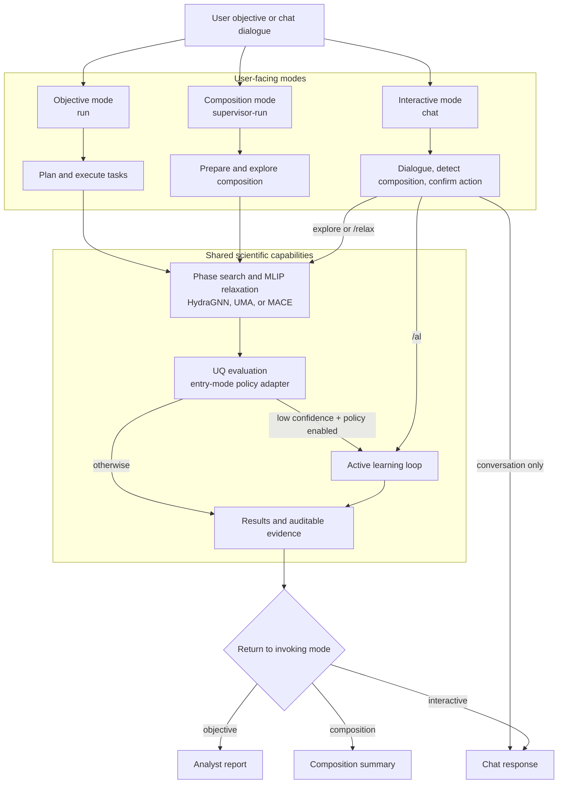

# Package architecture

The library is organized around stable scientific responsibilities rather than
individual experiments or machines.

| Package | Responsibility |
| --- | --- |
| `orchestration` | Typed workflow state, objective/composition graphs, and explicit policies |
| `discovery` | Composition parsing, structure generation, and stability analysis |
| `active_learning` | Candidate acquisition, uncertainty evaluation, labeling, and adaptation loops |
| `backends.llm` | Configuration-selected language-model providers |
| `backends.mlip` | MLIP calculators, relaxation, and exploration interfaces |
| `backends.dft` | Quantum ESPRESSO and VASP interfaces |
| `execution` | Scheduler-neutral resources, launch contracts, and provenance |
| `workflows` | Composable relaxation, phase-exploration, and investigation policies/results |

The workflow layer uses `execution.contracts` for evidence, validation,
approval, compute-budget, provenance, status, and result envelopes. Scientific
run directories are owned by `execution.run_directory`; scheduler allocation
discovery and disjoint DFT node grouping are owned by `execution.allocation`.
See [Scientific workflow contracts](scientific-workflows.md) for behavior and
[Run artifacts and restarts](run-artifacts-and-restarts.md) for persistence.

## Orchestration topology

The CLI exposes objective, composition, and interactive modes over shared
scientific capabilities. Each mode can hand low-confidence work to the same
active-learning implementation when its UQ policy permits it. The full diagram is maintained in
[Agentic AI Workflow Diagram](workflows/agentic-ai-workflow.md), with a compact
variant in [Agentic AI Workflow Slides](workflows/agentic-ai-workflow-slides.md).

Machine-specific setup and job scripts live in `deployments/`; research-only
paper and Codabench artifacts live in `research/`.

## Five stable interfaces

Each backend boundary is defined by a `@runtime_checkable` Protocol so that
new implementations only need to satisfy the structural contract — no
inheritance required.

| Interface | Import path | Key methods / attributes |
| --- | --- | --- |
| `DFTBackend` | `matsim_agents.backends.dft` | `name`, `run_one(spec) → DFTResult` |
| `MLIPBackend` | `matsim_agents.backends.mlip` | `name`, `as_calculator() → Calculator`, `relax(atoms, *, fmax, max_steps) → RelaxationResult` |
| `LLMBackend` | `matsim_agents.backends.llm` | type alias for `langchain_core.language_models.BaseChatModel` |
| `ExecutionPlatform` | `matsim_agents.execution` | `name`, `submit(cmd, *, resources, workdir) → str`, `available_resources() → ResourceRequest` |
| `RunStore` | `matsim_agents.execution` | `append(record) → None`, `iter_records() → Iterable` |

These backend Protocols are extension boundaries. The newer scientific
workflow models are policy and result contracts layered above them, not
replacement backend interfaces.

`JsonlRunStore` in `matsim_agents.execution.provenance` is the concrete
`RunStore` implementation backed by a newline-delimited JSON file.

## Compatibility policy

The first migration release retains aliases at the former import paths (for
example, `matsim_agents.graph`, `matsim_agents.state`, and
`matsim_agents.tools.relaxation`).  New code should import from the canonical
packages.  The aliases can be deprecated in a later release after downstream
users have migrated.
