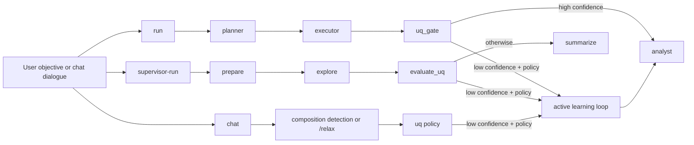

# Agentic AI Workflow Diagram (Slides)

Compact, left-to-right variant optimized for slide decks.

## Slide Notes

- Use this version when horizontal space is available and text should stay minimal.
- Keep node labels short to reduce line wrapping in presentation exports.
