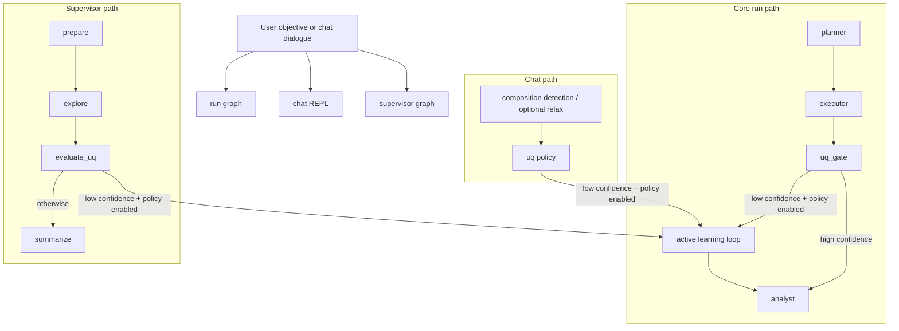

# Agentic AI Workflow Diagram

This page provides a reusable, standalone diagram for presentations, wiki pages, and architecture notes.

Slide-friendly compact variant: [agentic-ai-workflow-slides.md](agentic-ai-workflow-slides.md)

## Notes

- All three orchestration entry points can escalate into the same active-learning loop.
- UQ policy thresholds are configurable from CLI flags (`--uq-top-weight-threshold`, `--uq-min-unreliable-fraction`, and related handoff options).
- Handoff decisions are auditable via JSONL artifacts when `--al-handoff-audit-path` is set (or through default audit paths).
