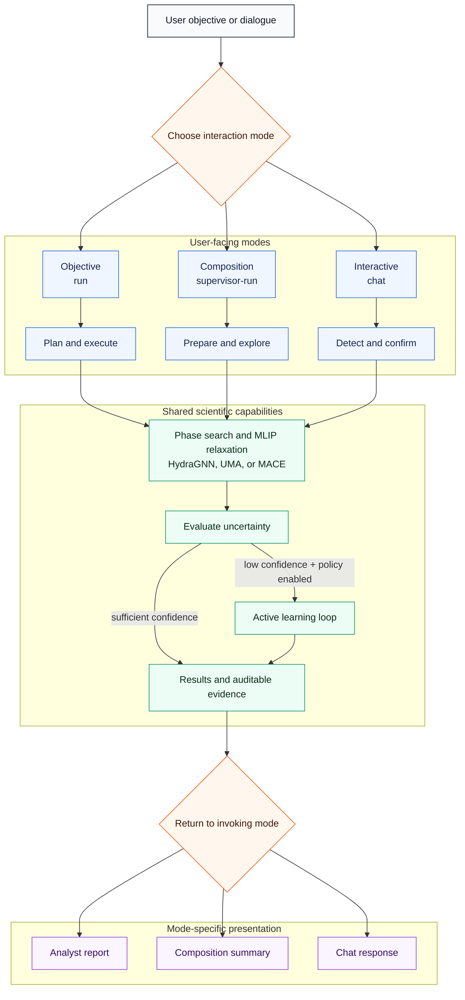

# Agentic AI Workflow Diagram

This page provides a reusable, standalone diagram for presentations, wiki pages, and architecture notes.

Slide-friendly compact variant: [agentic-ai-workflow-slides.md](agentic-ai-workflow-slides.md)

```mermaid
flowchart TD
    U[User objective or dialogue] --> G{Choose interaction mode}

    subgraph MODES[User-facing modes]
      direction LR
      O[Objective<br/>run] --> OP[Plan and execute]
      P[Composition<br/>supervisor-run] --> PP[Prepare and explore]
      I[Interactive<br/>chat] --> IP[Detect and confirm]
    end

    G --> O
    G --> P
    G --> I

    OP --> X
    PP --> X
    IP --> X

    subgraph SCIENCE[Shared scientific capabilities]
      X[Phase search and MLIP relaxation<br/>HydraGNN, UMA, or MACE]
      Q[Evaluate uncertainty]
      AL[Active learning loop]
      E[Results and auditable evidence]

      X --> Q
      Q -->|low confidence + policy enabled| AL
      Q -->|sufficient confidence| E
      AL --> E
    end

    E --> R{Return to invoking mode}

    subgraph OUTPUTS[Mode-specific presentation]
      direction LR
      OA[Analyst report]
      PS[Composition summary]
      IR[Chat response]
    end

    R --> OA
    R --> PS
    R --> IR

    classDef entry fill:#f8fafc,stroke:#475569,color:#0f172a,stroke-width:1.5px
    classDef mode fill:#eff6ff,stroke:#2563eb,color:#172554
    classDef science fill:#ecfdf5,stroke:#059669,color:#052e16
    classDef decision fill:#fff7ed,stroke:#ea580c,color:#431407
    classDef output fill:#faf5ff,stroke:#9333ea,color:#3b0764
    class U entry
    class G,R decision
    class O,OP,P,PP,I,IP mode
    class X,Q,AL,E science
    class OA,PS,IR output
```

## Notes

- Objective, composition, and interactive modes are user-facing adapters, not
  separate scientific workflows. They share discovery, relaxation, and
  active-learning capabilities, then format results for their invoking mode.
- UQ handoff policy is exposed through mode-specific adapters today; the
  diagram groups those adapters by their common responsibility.
- Interactive conversation-only turns return directly to chat, while `/al`
  invokes active learning directly; those shortcuts are omitted above to keep
  the primary scientific workflow legible.
- Fused HydraGNN branch weights can drive the UQ policy directly. Pinned-head
  HydraGNN uses MC-dropout when configured; UMA and MACE require another
  acquisition strategy because they do not emit HydraGNN branch weights.
- UQ policy thresholds are configurable from CLI flags (`--uq-top-weight-threshold`, `--uq-min-unreliable-fraction`, and related handoff options).
- Handoff decisions are auditable via JSONL artifacts when `--al-handoff-audit-path` is set (or through default audit paths).
