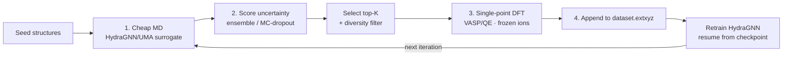
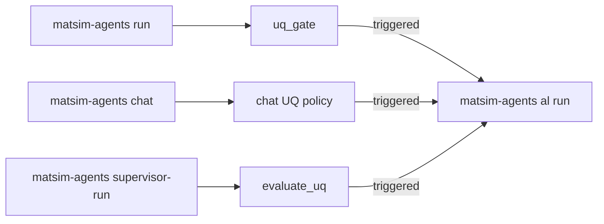

# Active-learning workflow: MLIP surrogate (HydraGNN or UMA) ↔ DFT (VASP or Quantum ESPRESSO)

End-to-end loop that uses an MLIP surrogate force field (HydraGNN or UMA) and either
**VASP 6.6** or **Quantum ESPRESSO `pw.x`** as the ground-truth labeller for
high-uncertainty structures discovered by surrogate-driven MD. The choice is
a single YAML field (`dft.backend: vasp | qe`).

Surrogate selection is controlled by the `mlip` block in the AL config:

- Default: `mlip.backend: hydragnn` (or `backend: ${MLIP_BACKEND:-hydragnn}`)
- Switch to UMA without editing YAML:

```bash
MLIP_BACKEND=uma matsim-agents al run examples/active_learning/al_config.example.yaml
```

## Methodology

Each iteration of the loop performs four steps:

1. **Cheap MD with the surrogate.** Short molecular-dynamics trajectories are
   run from the seed structures using the MLIP surrogate (HydraGNN or UMA) as
   the ASE calculator — *not* DFT. The driver is ASE's `Langevin` (NVT) by
   default (`NVTBerendsen` / `VelocityVerlet` are alternatives), started from
   Maxwell–Boltzmann velocities at `md.temperature_K`. The heat-up deliberately
   drives the (intentionally un-relaxed) seeds off their idealised positions to
   explore configuration space at MLIP cost.

2. **Detect high-uncertainty snapshots.** Every MD snapshot is scored by a
   force-disagreement uncertainty (in eV/Å): `ensemble` (std across ≥2
   independently trained models), `mc_dropout` (std across stochastic forward
   passes), `ensemble_then_dropout`, or `random` (baseline). The top
   `acquisition.n_select` most-uncertain frames are kept, optionally after a
   greedy farthest-point **diversity filter** so DFT is not wasted on
   near-duplicate structures.

3. **Single-point DFT labelling — no geometry optimization.** The selected
   frames are labelled with first-principles DFT (VASP or Quantum ESPRESSO),
   computing energy, forces, and stress **at the exact MD geometry**. These are
   single-point calculations with **frozen ions**: VASP uses `NSW=0` /
   `IBRION=-1` and QE uses `calculation='scf'`. The geometry is deliberately
   *not* relaxed — the whole point is to label the off-equilibrium,
   high-uncertainty configuration the surrogate is unsure about; relaxing it
   would move the atoms back toward equilibrium and discard exactly the
   information AL is trying to capture.

4. **Augment the dataset and retrain.** Converged DFT results are appended to a
   cumulative `dataset.extxyz` (each frame tagged with `al_iteration` and
   `dft_backend`), and HydraGNN is retrained by resuming from the previous
   iteration's checkpoint. The updated surrogate then drives the next
   iteration's MD, closing the loop. (With a frozen UMA foundation model,
   retraining is skipped and the labels accumulate for offline fine-tuning.)



## How this relates to other workflows

The repository now exposes several connected workflows. This README documents
the AL kernel itself (`matsim-agents al run`), while the other entry points
can feed into it:

- `matsim-agents run`: core planner -> executor -> uq_gate -> analyst graph,
  with optional run-path AL handoff on low-confidence relaxations.
- `matsim-agents chat`: interactive discovery REPL; can optionally escalate to
  AL when UQ is high (`--trigger-al-handoff`, `--al-config`).
- `matsim-agents supervisor-run`: LangGraph supervisor that runs discovery
  exploration, evaluates UQ, and conditionally launches AL handoff.

In other words, AL is both a standalone workflow and the downstream execution
engine for automated escalation from discovery.

> **Not the same as `examples/active_learning_uq.py`.** That standalone example
> demonstrates a *relaxation-based*, UQ-gated handoff — it runs a HydraGNN
> **geometry optimization** on each structure and escalates to reference DFT
> when the branch-weight UQ proxy looks unreliable. The `al run` loop documented
> here is different: it uses cheap surrogate **molecular dynamics** (not
> relaxation) to generate candidate snapshots, scores them by ensemble /
> MC-dropout force disagreement, and labels them with single-point (frozen-ion)
> DFT. Same UQ-gating idea, different surrogate simulation.

## Agentic workflow map



## Files

- `al_config.example.yaml`         — Unified config: contains both `dft.vasp:`
  and `dft.qe:` sub-blocks; flip `dft.backend:` to choose the labeller.
- `al_config.prompt.example.yaml`  — LLM-generated seeds (works with either backend).
- `INCAR.template`                 — VASP single-point INCAR (MI250X-tuned).
- `pw.template`                    — Quantum ESPRESSO `pw.in` namelist template
  (analogue of INCAR.template; the backend appends ATOMIC_SPECIES /
  CELL_PARAMETERS / ATOMIC_POSITIONS / K_POINTS automatically).
- `seeds/`                          — Drop seed POSCAR/CIF/XYZ files here
  (only used when `md.seed_source.kind: paths`).

> **Energy-reference warning.** VASP PAW totals and QE pseudopotential totals
> are NOT directly comparable. The dataset writer tags every frame with
> `info["dft_backend"]`; never train one HydraGNN model on a mixed VASP+QE
> dataset without an explicit per-backend energy offset.

## Variable substitution in config YAMLs

Both example YAMLs use shell-style placeholders that are expanded at load
time by `ALConfig.from_yaml`:

| Syntax                  | Meaning                                          |
| ----------------------- | ------------------------------------------------ |
| `${VAR}`                | required; raises if unset                        |
| `${VAR:-default}`       | falls back to `default` if unset                 |
| `${VAR:?error message}` | aborts validate-config with `error message`      |

Values resolve in this order: (1) `os.environ`, (2) the optional top-level
`vars:` block in the YAML itself. Nested references inside `vars:` are
resolved iteratively, so e.g. `VASP_BIN: ${PROJ_ROOT}/external/.../vasp_std`
just works.

Example — re-target the same YAML at a different checkout/run without
editing it:

```bash
PROJ_ROOT=$PWD \
RUNS_ROOT=/path/to/scratch/runs \
RUN_TAG=experiment-42 \
DFT_BACKEND=qe \
matsim-agents al validate-config examples/active_learning/al_config.example.yaml
```

The `vars:` block is consumed before pydantic validation, so it never appears
in the parsed `ALConfig`.

## Quick start on Frontier

1. Build VASP (one-time):
   ```bash
   nohup bash deployments/frontier/setup/build-vasp-gpu-frontier.sh \
       > runs/build-vasp-gpu-login/build.log 2>&1 &
   ```

2. Edit `al_config.example.yaml`:
   - Point `hydragnn.logdir` at a trained HydraGNN logdir.
   - Choose a seed source under `md.seed_source` — see *Seed sources* below.
   - Choose `dft.backend: vasp` (and fill `dft.vasp.*`) **or** `dft.backend: qe`
     (and fill `dft.qe.*`).
   - For VASP: point `dft.vasp.potcar_dir` at your POTCAR collection (one
     POTCAR per element). For QE: point `dft.qe.pseudo_dir` at a UPF
     pseudopotential library (e.g. SSSP-PBE-efficiency).

3. Validate:
   ```bash
   matsim-agents al validate-config examples/active_learning/al_config.example.yaml
   ```

4. Submit the SLURM job:
   ```bash
   sbatch --export=ALL,AL_CONFIG=$PWD/examples/active_learning/al_config.example.yaml \
       -N 64 -t 12:00:00 \
       deployments/frontier/launchers/run-active-learning-frontier.sh
   ```

### Trigger this same AL flow from supervisor-run

If you prefer orchestration with explicit decision nodes, run the supervisor
graph and let it trigger this AL path when UQ policy thresholds are met:

```bash
matsim-agents supervisor-run Li2MnO3 \
  --logdir /path/to/hydragnn_logdir \
  --hydragnn-branch-mlp-checkpoint /path/to/mlp_branch_weights.pt \
  --al-config examples/active_learning/al_config.example.yaml \
  --al-run
```

## Minimum viable commands

```bash
# 1) Validate config only
matsim-agents al validate-config examples/active_learning/al_config.example.yaml

# 2) Run AL directly
matsim-agents al run examples/active_learning/al_config.example.yaml

# 2b) Same AL config, UMA surrogate backend
MLIP_BACKEND=uma matsim-agents al run examples/active_learning/al_config.example.yaml

# 3) Run via supervisor orchestration (dry-run handoff)
matsim-agents supervisor-run Li2MnO3 \
  --logdir /path/to/hydragnn_logdir \
  --hydragnn-branch-mlp-checkpoint /path/to/mlp_branch_weights.pt \
  --al-config examples/active_learning/al_config.example.yaml \
  --al-dry-run

# 4) Run path with UQ-triggered AL handoff planning
matsim-agents run \
  "Relax structures/mos2-B_Defect-Free_PBE.vasp and summarize results." \
  --logdir /path/to/hydragnn_logdir \
  --hydragnn-branch-mlp-checkpoint /path/to/mlp_branch_weights.pt \
  --trigger-al-handoff \
  --al-config examples/active_learning/al_config.example.yaml \
  --al-dry-run
```

## Architecture

```
┌──────────────────────────────────────────────────────────────────────┐
│  SLURM allocation (64 nodes, 12 h)                                   │
│  Parent shell: PrgEnv-gnu + rocm/7.2.0 + HydraGNN venv               │
│                                                                      │
│  python -m matsim_agents.cli al run al.yaml                          │
│    │                                                                 │
│    ├── for iter in 0..N:                                             │
│    │     ├── load HydraGNN calculator(s)                             │
│    │     ├── sample MD candidates (in-process)                       │
│    │     ├── score: ensemble / MC-dropout / random                   │
│    │     ├── select top-K with diversity filter                      │
│    │     ├── ── ThreadPoolExecutor(K parallel) ──┐                   │
│    │     │     bash _vasp-step-frontier.sh       │ inner srun step   │
│    │     │       module reset → PrgEnv-cray      │ rocm/7.1.1        │
│    │     │       srun -N1 -n8 vasp_std           │                   │
│    │     │     parse OUTCAR/vasprun → labels  ←──┘                   │
│    │     ├── append to dataset.extxyz                                │
│    │     └── bash _hydragnn-train-step-frontier.sh                   │
│    │           srun -N8 -n64 python train.py --dataset ... --resume  │
│    └──                                                                │
└──────────────────────────────────────────────────────────────────────┘
```

Why two module stacks: the DFT labeller (VASP or QE) needs Cray Fortran
(`PrgEnv-cray + cce`) for OpenMP target offload. The HydraGNN/PyTorch venv
was built against `PrgEnv-gnu + rocm/7.2.0`. They cannot coexist in one
shell, but they do coexist in one SLURM job — every DFT step does
`module reset` in a fresh bash subshell
(`_vasp-step-frontier.sh` or `_qe-step-frontier.sh`),
then `srun` against the allocation.

## Resume

Each iteration writes `out_dir/iteration_NNNN/state.json` with `status:
"complete"` only on success. On restart the loop scans for the highest
completed iteration, deletes any partial directory, and resumes from there
without double-counting DFT results.

## Seed sources

The MD sampler’s starting structures come from `md.seed_source` — pick **one** of:

```yaml
md:
  seed_source:
    kind: paths            # explicit list of files
    paths: [seeds/Si.vasp, seeds/SiO2.vasp]
```

```yaml
md:
  seed_source:
    kind: compositions     # formulas → prototype seeds via discovery enumerator
    compositions: [LiCoO2, LiFePO4, Cs2AgBiBr6]
    max_phases_per_composition: 2
    n_random: 0            # set >0 to add pyXtal random-search seeds per formula
```

```yaml
md:
  seed_source:
    kind: prompt           # LLM expands a free-text target into formulas
    prompt: "Pb-free halide double perovskites for photovoltaics"
    llm:
      provider: vllm       # ollama | vllm | openai | anthropic | huggingface
      model: Qwen/Qwen2.5-72B-Instruct
      base_url: http://localhost:8000/v1
    max_compositions: 6
    max_phases_per_composition: 2
```

For `kind: prompt` the LLM proposal is persisted as
`<out_dir>/seeds/llm_proposed_compositions.json` so the run is reproducible.
For `kind: compositions` and `kind: prompt`, formulas are expanded into
seed structures via
[`matsim_agents.discovery.generate_seeds`](../../src/matsim_agents/discovery/seeds.py),
which enumerates every AFLOW prototype whose stoichiometric signature
matches the target composition (288 entries from
`pymatgen.analysis.prototypes`, covering elemental phases, rocksalt/CsCl/
zincblende/wurtzite/rutile, perovskite, spinel, double perovskite, …),
substitutes the elements, and dedupes with `StructureMatcher`. Set
`n_random > 0` to additionally draw pyXtal random-symmetry seeds (these
are flagged `needs_dft_verification` so any AL discovery built on them is
clearly marked as novel). The seeds are intentionally **not** pre-relaxed
— the MD heat-up immediately drives them off their idealised positions,
which is exactly the regime AL needs.
