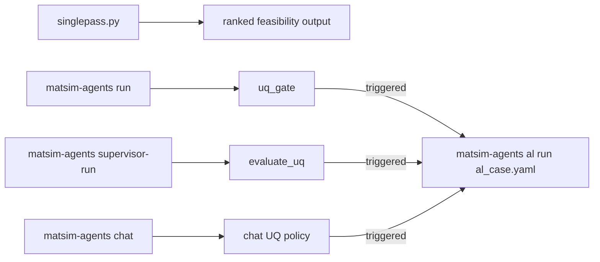

# Paper Submission Test Cases

Test cases prepared for the FORUMAI / matsim-agents paper, based on
categories proposed by Zekun Chen (2026-06-10).

Every system has **two entry points**:

* **Single pass** — `singlepass.py --case <name>`: runs the agent graph *once*
  (MLIP relax + polymorph ranking, optional one DFT validation single-point via
  `--dft`). Fast sanity / feasibility read. No retraining loop.
* **Active learning** — `al_<name>.yaml`: the full discovery → uncertainty
  acquisition → DFT labeling → retrain loop.

All paths use `$PROJ_ROOT` = repo root and `$RUNS_ROOT` = scratch directory.

## How these cases map to repo workflows

These paper cases can be executed through three complementary entry points:

- Single pass (`singlepass.py`): one-shot graph execution for a quick sanity
  check and ranking (no AL retraining loop).
- Core graph (`matsim-agents run`): planner -> executor -> uq_gate -> analyst,
  with optional run-path AL handoff when UQ thresholds are crossed.
- Active learning (`matsim-agents al run al_<case>.yaml`): iterative
  discovery -> UQ/acquisition -> DFT labeling -> retraining loop.
- Supervisor orchestration (`matsim-agents supervisor-run`): LangGraph control
  layer that can run discovery exploration, evaluate UQ, and conditionally
  hand off to AL using a base AL YAML.

The discovery chat path (`matsim-agents chat`) can also feed these cases by
detecting formulas, optionally running `/relax <structure_path>`, and
escalating to AL when configured UQ thresholds are crossed.



---

## Coverage matrix

| # | System | Dim | Single pass | Active learning |
|---|--------|-----|-------------|-----------------|
| 1 | LiFePO₄ olivine | 3D | `singlepass.py --case lifepo4` | `al_lifepo4.yaml` |
| 2a | NbTaVHfZrTi BCC HEA | 3D | `singlepass.py --case hea_bcc` | `al_hea_bcc.yaml` |
| 2b | CrMnFeCoNi Cantor FCC HEA | 3D | `singlepass.py --case hea_fcc` | `al_hea_fcc_cantor.yaml` |
| 3 | Phosphorene (black-P / blue-P) | 2D | `singlepass.py --case phosphorene` | `al_phosphorene.yaml` |
| 4 | Cu-BHT conductive MOF | 2D | `singlepass.py --case cu_bht` † | `al_cu_bht_2d.yaml` † |
| 5 | Zn(HCOO)₂ MOF | 3D | `singlepass.py --case zn_formate` | `al_zn_formate.yaml` |

† Cu-BHT requires a supplied CIF. The single-pass runner first checks the
run-scoped path `out_singlepass/<run-id>/cu_bht/seeds/cu_bht_monolayer.cif`,
then falls back to `examples/paper_cases/seeds/cu_bht_monolayer.cif`.
The inorganic prototype enumerator cannot build the organic BHT ligand; all
other cases build their seeds automatically.

---

## Directory layout

```
examples/paper_cases/
├── README.md                     ← this file
│
├── singlepass.py                 ← unified single-pass runner (all 6 cases)
│
├── al_lifepo4.yaml               ← Case 1
├── al_hea_bcc.yaml               ← Case 2a
├── al_hea_fcc_cantor.yaml        ← Case 2b
├── al_phosphorene.yaml           ← Case 3
├── al_cu_bht_2d.yaml             ← Case 4
├── al_zn_formate.yaml            ← Case 5
│
└── seeds/                        ← structure seeds (auto-written by singlepass.py)
    ├── lifepo4_olivine.extxyz
    ├── hea_bcc_bcc_random.extxyz
    ├── hea_fcc_fcc_random.extxyz
    ├── phosphorene_black_P.extxyz
    ├── phosphorene_blue_P.extxyz
    ├── zn_formate_alpha.extxyz
    ├── zn_formate_beta.extxyz
    └── cu_bht_monolayer.cif       ← USER-SUPPLIED (from COD/MP/ChemRxiv)
```

---

## Quick start

```bash
source deployments/perlmutter/setup/setup_matsim_perlmutter.sh
export PROJ_ROOT=$PWD
export RUNS_ROOT=/global/cfs/projectdirs/m5216/mlupopa/runs
export MLIP_LOGDIR=$RUNS_ROOT/al-models/iter0_logdir

# 1) write every seed structure (no agent run) — useful before AL too:
python examples/paper_cases/singlepass.py --all --seeds-only

# 2) single pass on one system (MLIP only):
python examples/paper_cases/singlepass.py --case lifepo4

# 3) single pass with one DFT validation single-point (VASP):
python examples/paper_cases/singlepass.py --case lifepo4 --dft

# 4) active learning on the same system:
matsim-agents al validate-config examples/paper_cases/al_lifepo4.yaml
matsim-agents al run            examples/paper_cases/al_lifepo4.yaml

# 4b) same AL config, UMA surrogate backend:
MLIP_BACKEND=uma matsim-agents al run examples/paper_cases/al_lifepo4.yaml

# 5) supervisor-driven discovery -> optional AL handoff:
matsim-agents supervisor-run LiFePO4 \
  --logdir $MLIP_LOGDIR \
  --hydragnn-branch-mlp-checkpoint best_model.pt \
  --al-config examples/paper_cases/al_lifepo4.yaml \
  --al-dry-run
```

> **Note:** on Perlmutter, submit the full AL loop with
> `deployments/perlmutter/jobs/job-active-learning-paper-cases-perlmutter.sh`
> (select the system with `CASE=<name>`), or wrap `matsim-agents al run
> <config>` in your own `sbatch` script / interactive `salloc` GPU node.
>
> **Multi-node DFT:** the AL driver runs VASP single-points concurrently, up to
> `SLURM_JOB_NUM_NODES / nodes_per_job` at once. The job script defaults to
> `-N 1` (serial DFT); pass more nodes for parallelism, e.g. `sbatch -N 4 ...`
> gives 4-way concurrency for the `nodes_per_job: 1` cases (lifepo4, hea_bcc,
> hea_fcc, phosphorene). **`zn_formate` uses `nodes_per_job: 2`** (dense
> framework cell), so it **must** be submitted with `-N >= 2` (use `-N 4` for
> 2-way concurrency) — with `-N 1` every DFT step fails with
> `srun: error: Only allocated 1 nodes asked for 2`.
>
> **UMA prerequisite:** with `MLIP_BACKEND=uma`, the UMA weights must be
> **prefetched** first — compute nodes have no internet and read the HF cache
> offline. Run `sbatch deployments/perlmutter/download/download-uma-perlmutter.sh`
> once. See `docs/model-download.md` ("UMA MLIP weights on Perlmutter").

> **Integration note:** `--al-dry-run` in `supervisor-run` only reports the
> planned handoff. Use `--al-run` to actually execute the AL loop.

## Minimum viable commands

```bash
# 1) Generate seeds for all paper cases
python examples/paper_cases/singlepass.py --all --seeds-only

# 2) One case, single-pass feasibility run
python examples/paper_cases/singlepass.py --case lifepo4

# 3) Run one AL case directly
matsim-agents al validate-config examples/paper_cases/al_lifepo4.yaml
matsim-agents al run examples/paper_cases/al_lifepo4.yaml

# 4) Supervisor path with optional AL handoff planning
matsim-agents supervisor-run LiFePO4 \
  --logdir "$MLIP_LOGDIR" \
  --hydragnn-branch-mlp-checkpoint best_model.pt \
  --al-config examples/paper_cases/al_lifepo4.yaml \
  --al-dry-run

# 5) Core run path with UQ-triggered AL handoff planning
matsim-agents run \
  "Relax structures/lifepo4_olivine.vasp and summarize results." \
  --logdir "$MLIP_LOGDIR" \
  --hydragnn-branch-mlp-checkpoint best_model.pt \
  --trigger-al-handoff \
  --al-config examples/paper_cases/al_lifepo4.yaml \
  --al-dry-run
```

The single-pass runner uses these environment variables:

| Variable | Meaning | Default |
|----------|---------|---------|
| `MLIP_LOGDIR` | HydraGNN logdir (config.json + checkpoint) | `$RUNS_ROOT/al-models/iter0_logdir` |
| `HYDRAGNN_BRANCH_MLP_CHECKPOINT` | checkpoint filename | `best_model.pt` |
| `OUT_DIR` | output root | `./out_singlepass` |

For AL YAMLs in this folder, the surrogate backend can be switched with one
env var when configs use `backend: ${MLIP_BACKEND:-hydragnn}`:

```bash
matsim-agents al run examples/paper_cases/al_lifepo4.yaml        # HydraGNN (default)
MLIP_BACKEND=uma matsim-agents al run examples/paper_cases/al_lifepo4.yaml
```

---

## Case 1 — LiFePO₄: battery cathode polymorph search

**Single pass:** relaxes the olivine seed and reports energy/atom + RMSD.
**AL (`al_lifepo4.yaml`):** `seed_source.kind: compositions` `[LiFePO4]`,
`n_random: 4` (pyXtal), `acquisition.strategy: mc_dropout`.
**Science:** FORUMAI battery-design thrust; tests whether pyXtal random seeds
surface structures beyond the olivine prototype.
**Expected:** olivine ranked lowest; maricite ≥ +60 meV/f.u. within 3 AL iterations.

---

## Case 2a — NbTaVHfZrTi: refractory BCC HEA

**Single pass:** builds a 24-atom equimolar BCC supercell (random site
assignment, fixed seed) and relaxes it.
**AL (`al_hea_bcc.yaml`):** 7 equimolar + sub-lattice compositions, `n_random: 6`,
`acquisition.strategy: mc_dropout`, `ISMEAR=1` (Methfessel–Paxton, metallic).
**Expected:** BCC preferred; 2–3 sub-lattice compositions with lower formation enthalpy.

---

## Case 2b — CrMnFeCoNi (Cantor alloy): FCC HEA with SRO

**Single pass:** builds a 32-atom near-equimolar FCC supercell and relaxes it.
**AL (`al_hea_fcc_cantor.yaml`):** 5 compositions, `n_random: 4`,
`acquisition.strategy: mc_dropout`, `ISPIN=2`.
**Science:** first FCC HEA with documented experimental SRO (Wang et al., Nature 2021).
**Note:** for an explicit collinear spin guess, add a `MAGMOM` entry to
`dft.vasp.extra_incar` matching the POSCAR species ordering.

---

## Case 3 — Phosphorene: 2D black-P vs blue-P

**Single pass:** builds both polymorphs (black-P Pmna, blue-P P-3m1), relaxes and
ranks them. The objective string flags the cell as a 2D slab.
**AL (`al_phosphorene.yaml`):** `seed_source.kind: paths` (black-P seed),
`n_random: 3`, `ISMEAR=0` (semiconductor); `KSPACING` auto-yields a single
k-point along the vacuum axis.
**Expected:** black-P lower by ~30 meV/atom; RMSD < 0.05 Å.
**Caveat:** the bundled geometry is approximate — replace with the reference QE
structure cited in the email (materialssquare.com/work/43421) for the paper.

---

## Case 4 — Cu-BHT: conductive 2D MOF

**Single pass:** loads `cu_bht_monolayer.cif` from the run-scoped seeds directory
when present, otherwise from `examples/paper_cases/seeds/`, and relaxes it
(skips with a clear message if the CIF is absent in both locations).
**AL (`al_cu_bht_2d.yaml`):** `seed_source.kind: paths`, `n_random: 3`,
`ISMEAR=1` (metallic), `nodes_per_job: 2`.
**Prerequisite:** place a validated Cu₃C₆S₆ CIF at
`examples/paper_cases/seeds/cu_bht_monolayer.cif` (MP id mp-630956 recommended).
**Expected:** AA-stacked lower by > 10 meV/Cu; CuS₄ square-planar coordination preserved.

---

## Case 5 — Zn(HCOO)₂: MOF feasibility check

**Single pass:** builds both polymorphs (alpha Pna2₁, beta P2₁2₁2₁), relaxes and
ranks them. `--dft` adds a PBE reference single-point.
**AL (`al_zn_formate.yaml`):** `seed_source.kind: paths`, `n_random: 3`,
`ISMEAR=0` (insulating MOF), `nodes_per_job: 2`.
**Expected:** alpha lower by ~15 meV/f.u.; RMSD < 0.08 Å. Larger RMSD flags
out-of-distribution transferability for the paper's discussion.
**Caveats:** (1) the bundled structure is a simplified placeholder **without the
formate H atoms** — replace with a real CIF (incl. H) before DFT labeling;
(2) per the email, a universal potential (e.g. UMA) may label hybrid
organic-inorganic MOFs better than the inorganic-trained HydraGNN model.

---

## Environment setup (all cases)

```bash
source deployments/perlmutter/setup/setup_matsim_perlmutter.sh
export PROJ_ROOT=$PWD
export RUNS_ROOT=/global/cfs/projectdirs/m5216/mlupopa/runs
export MLIP_LOGDIR=$RUNS_ROOT/al-models/iter0_logdir
export VASP_BIN=$PROJ_ROOT/external/vasp6/src/vasp.6.6.0/bin/vasp_std
export POTCAR_DIR=/global/cfs/projectdirs/m5216/mlupopa/POTCAR/PBE.54

matsim-agents al validate-config examples/paper_cases/<config>.yaml
```

POTCARs for all six cases (Li Fe P O Nb Ta V Hf Zr Ti Cr Mn Co Ni Cu C S Zn H)
are staged under `$POTCAR_DIR` as bare-symbol subdirectories.

## Dependencies

| Feature | Extra install needed |
|---------|---------------------|
| `n_random > 0` (pyXtal seeds) | Nothing extra (pyxtal is a core dependency, installed by default) |
| `acquisition.strategy: mc_dropout` | Nothing extra (works with a single checkpoint) |
| `acquisition.strategy: ensemble` / `ensemble_then_dropout` | ≥2 entries in `hydragnn.ensemble_paths` |
| VASP DFT backend | Perlmutter VASP GPU build at `external/vasp6/` + licensed POTCARs at `$POTCAR_DIR` |
| 2D slabs (phosphorene, Cu-BHT) | Handled via `KSPACING` (auto single k-point along vacuum); no special flag |
